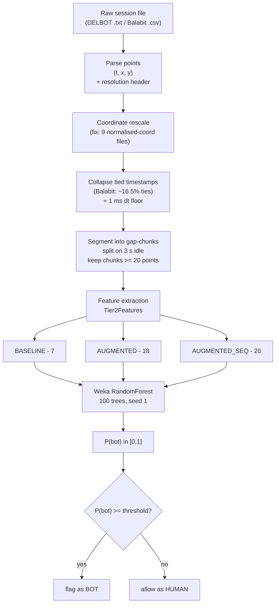
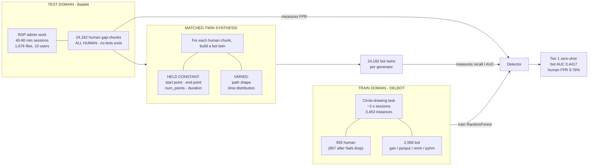
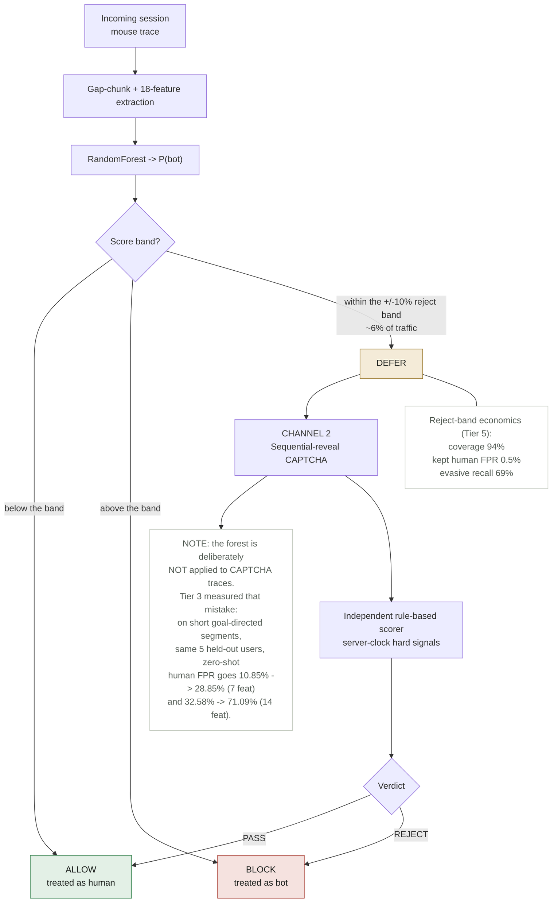
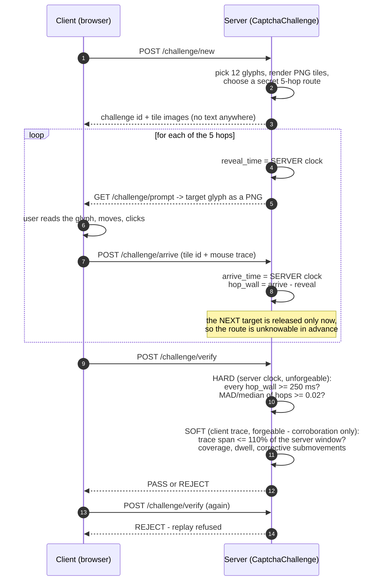

# A-to-Z guide for the conference paper

**What this file is.** A plain-language walkthrough of the whole project — the
problem, the datasets, every technique, every result, every weakness — laid out in
the order a conference paper is usually written, plus copy-pasteable architecture
diagrams. It is written for someone who is *not* a developer.

> **⚠️ Sourcing rule — read this before you quote anything.**
> Every number in this file was copied from **`CROSS_DOMAIN_STUDY.html`** on
> **2026-09-07**. That HTML file is the project's single source of truth. If a
> number here ever disagrees with a number there, **the study HTML wins** and this
> file is the one that is wrong.
>
> Do **not** pull numbers out of `TIER1-4_EVALUATION.html` or `AGENT_HANDOFF.txt`.
> Both are stale and contain **retracted** figures.
>
> **Retracted — never put these in the paper:** Balabit FPR `1.07%` or `16.69%`;
> mightymerge FPR `0.71%` or `2.18%`; cross-domain AUC `0.5326`; "12.4% human FPR"
> described as a model defect; "cross-dataset RF AUC 0.72" attributed to
> arXiv 2504.21415.
>
> Also careful: several tables in the study HTML show a **"pre-rescale"** column
> next to a **"post-rescale"** column. Always take the post-rescale (right-hand)
> one.
>
> **Every number in this file was then re-checked line by line against the raw
> `*_results.txt` output files on 2026-09-07.** That audit found **one stale number
> circulating in the repository** — see [§21](#21-number-audit--what-was-verified-and-what-was-wrong).
> Full raw percentages are in [§20](#20-complete-execution-results).

---

## Table of contents

1. [Glossary — read this first](#1-glossary--read-this-first)
2. [The one-paragraph version](#2-the-one-paragraph-version)
3. [The problem, and why it matters](#3-the-problem-and-why-it-matters)
4. [The datasets](#4-the-datasets)
5. [Method part 1 — turning raw mouse logs into rows of numbers](#5-method-part-1--turning-raw-mouse-logs-into-rows-of-numbers)
6. [Method part 2 — the features](#6-method-part-2--the-features)
7. [Method part 3 — the classifier](#7-method-part-3--the-classifier)
8. [Method part 4 — how we made bots for a dataset with no bots](#8-method-part-4--how-we-made-bots-for-a-dataset-with-no-bots)
9. [Experimental design — the splits](#9-experimental-design--the-splits)
10. [The two bug corrections (this belongs in the paper)](#10-the-two-bug-corrections-this-belongs-in-the-paper)
11. [Results, tier by tier](#11-results-tier-by-tier)
12. [The second channel — the sequential-reveal CAPTCHA](#12-the-second-channel--the-sequential-reveal-captcha)
13. [The live demo](#13-the-live-demo)
14. [Architecture diagrams](#14-architecture-diagrams)
15. [Limitations / threats to validity](#15-limitations--threats-to-validity)
16. [Related work — placeholders only, nothing verified](#16-related-work--placeholders-only-nothing-verified)
17. [Conclusion](#17-conclusion)
18. [Reproducibility appendix](#18-reproducibility-appendix)
19. [Suggested paper skeleton](#19-suggested-paper-skeleton)
20. [**Complete execution results** — every percentage, straight from the output files](#20-complete-execution-results)
21. [**Number audit** — what was verified, and the one number that was wrong](#21-number-audit--what-was-verified-and-what-was-wrong)

---

## 1. Glossary — read this first

Every results table below is unreadable without these. Consider putting a short
version of this list in the paper too, or at least defining each term the first
time it appears.

| Term | Plain meaning |
|---|---|
| **Bot** | A program moving the mouse pointer instead of a person. |
| **Mouse dynamics** | The study of *how* a pointer moves — speed, pauses, wobble — rather than *where* it clicks. A behavioural biometric. |
| **Feature** | One number summarising a movement (e.g. "average speed"). A movement becomes a list of features = a "feature vector". |
| **Hand-crafted features** | Features a human designed and wrote formulas for, as opposed to features a deep-learning model discovers by itself. This project uses hand-crafted ones — that choice is the point of the study. |
| **Classifier** | The model that reads a feature vector and outputs a guess: human or bot. |
| **Random Forest (RF)** | A classifier made of many decision trees that vote. Here: 100 trees. |
| **J48** | Weka's name for a single decision tree (the C4.5 algorithm). We keep it only because a single tree is *readable* — you can print it and inspect what it learned. |
| **P(bot)** | The score the forest outputs: 0.0 = certainly human, 1.0 = certainly bot. |
| **Threshold / operating point** | The cut-off you compare P(bot) against. Score above it → call it a bot. Moving the threshold trades catching more bots against annoying more humans. |
| **FPR — false positive rate** | Share of **real humans** wrongly flagged as bots. Low is good. This is the number that decides whether a system is deployable. |
| **TPR / recall** | Share of **real bots** correctly caught. High is good. |
| **ROC-AUC** | One number summarising the whole threshold trade-off. **0.5 = coin flip / useless. 1.0 = perfect.** Below 0.5 means the model is worse than guessing (it has the classes backwards). |
| **EER — equal error rate** | The error rate at the threshold where FPR and miss-rate are equal. Lower is better; ~50% means useless. |
| **Zero-shot** | Train on dataset A, test on dataset B, with **no** examples from B in training. The hardest and most honest setting. |
| **Domain adaptation** | The opposite: you *do* let some data from B into training. Easier, but you must say so. |
| **Held-out** | Data deliberately excluded from training so the test is fair. |
| **Gap-chunk** | Our unit of analysis. A continuous burst of mouse activity, cut wherever the user was idle for 3 seconds or more. |
| **Matched twin** | A synthetic bot movement built to have the *same* start point, end point, number of points and duration as a specific real human movement. See §8 — this is the paper's key methodological trick. |
| **MAD** | Median absolute deviation — a measure of spread that ignores one weird outlier, unlike standard deviation. Used in the CAPTCHA scorer. |
| **Reject option** | Instead of forcing every case into "human" or "bot", let the model say "not sure" for a middle band of scores and send those cases somewhere else (here: to a CAPTCHA). |

---

## 2. The one-paragraph version

We train a Random Forest on hand-crafted mouse-movement features from one dataset
(DELBOT, short circle-drawing tasks) and test it on a completely different one
(Balabit, long remote-desktop admin sessions). It does **not** transfer: bot
ROC-AUC is **0.4417**, i.e. worse than a coin flip, and it wrongly flags **9.79%**
of real humans. We then run seven rounds of an arms race. Adding *synthetic* bots
built inside the target domain to the training set fixes the easy case
(AUC **0.998**). A deliberately evasive bot that copies the victim's own speed
statistics defeats that fix (AUC **0.526**). Adversarial training with a richer
18-feature set recovers it (AUC **0.9649**), and the apparently terrible false-positive
rate turns out to be a *threshold* artefact — properly calibrated, the system gets
**~74% evasive-bot recall at ~3.4% human FPR** on users it has never seen. Then a
*second* evasion strategy defeats that model too (AUC **0.86**), and is only covered
by training on it as well. **Conclusion: with hand-crafted features and trees,
behavioural bot detection is a measurable arms race, not a solved problem — every
defence is specific to the attack it was trained on.** Finally, because a
probabilistic detector can never be certain, we add a second, independent channel:
a sequential-reveal CAPTCHA whose timing is measured on the server's clock, as a
destination for the "not sure" band.

---

## 3. The problem, and why it matters

**The setting.** Websites need to tell automated traffic from real people —
for ticket scalping, credential stuffing, ad-click fraud, scraping, fake accounts.
One long-standing idea is *behavioural*: don't ask the user to solve a puzzle,
just watch how the mouse moves. People produce characteristic motion — they
accelerate, overshoot, correct, pause, wobble. Naive scripts move in straight
lines at constant speed.

**The gap in the literature.** Papers in this area almost always report results
*within* a single dataset: train on part of dataset A, test on the rest of dataset
A. Accuracies of 95–99% are common. But a deployed detector never gets that luxury
— it is trained on whatever data the vendor has and then meets traffic from a
completely different context, on different hardware, doing a different task.

**The two research questions of this paper:**

1. **Does a hand-crafted-feature mouse-dynamics detector transfer across datasets
   at all?** (Answer: no.)
2. **If we patch it, does the patch hold up against an adversary who adapts?**
   (Answer: only against the specific adversary it was trained on.)

**Why the second question is hard to even ask.** To measure bot detection on a
new dataset, you need bots in that dataset. Public mouse-dynamics datasets are
all-human. Our answer to that — matched synthetic twins, §8 — is a contribution in
its own right.

**Framing for the paper.** This is a **negative-result / measurement paper**. That
is a legitimate and valuable contribution, and it should be framed confidently, not
apologetically. The value is in (a) the honest cross-domain measurement nobody else
publishes, (b) the reproducible arms-race methodology, and (c) two feature-pipeline
bugs we found and corrected that invalidated our own early headline numbers — which
is exactly the kind of thing that silently inflates published results elsewhere.

### 3.4 Novelty — what is new here, and how it differs from other papers in this field

This is the **contributions** subsection of your Introduction. A reviewer decides
whether to keep reading based on it, so write it precisely.

> **⚠️ Honesty rule for this whole subsection.** Every claim below is a claim about
> *what this project does*. Wherever a claim needs a comparison to someone else's
> paper, it is written as **"to the best of our knowledge"** or marked
> `[TO VERIFY]`. That is deliberate — see [§16](#16-related-work--placeholders-only-nothing-verified)
> for why. **Do not upgrade a "to the best of our knowledge" into "unlike Smith et
> al." until you have personally read Smith et al.**

#### Five practices this study deliberately departs from

> **Why this table is written about *us*, not about other papers.** It is tempting
> to open a novelty section with "unlike prior work, which does X…". **Do not** —
> not from this repository. There is no verified literature survey here, the
> citations in the project's notes are flagged UNVERIFIED, and one was fabricated
> (§16). A characterisation of other people's papers that you cannot source is a
> straw man, and a reviewer who works in this field will attack it first.
>
> Every row below is instead a description of **our own pipeline's history** — each
> one is something this project genuinely did before it was corrected, so every row
> is defensible from our own record. That framing costs the section nothing and
> removes all citation risk. If you later verify that a practice really is common in
> the field, you can upgrade the framing then.

| Practice we started with | What it was hiding | Where we fixed it |
|---|---|---|
| **Train and test within one dataset** | Nothing is measured about a change of task, hardware, capture path or population — the exact change a deployed detector faces | Tier 1 (§11.1) |
| **Report AUC at the classifier's default 0.5 threshold** | The false-positive rate at a *usable* operating point is never shown — a 13.21% default-threshold FPR can be dressed up as "AUC 0.96" | Tier 5 (§11.5) |
| **Choose the operating point on the data you then report against** | Same-data optimism; we measured the cost at ~1.6–2.2× | Tier 5's CALIB/REPORT split (§9.3) |
| **Evaluate against one static adversary, once** | No round 2 — the result is a snapshot, not a trajectory | Tiers 4 and 7 (§11.4, §11.7) |
| **Fold bug fixes silently into the final numbers** | Two feature bugs inflated our own headline figures by up to 10⁶× | §10, with explicit retractions |

#### The six things this paper does differently

**N1 — A genuinely cross-dataset, two-sided bot-detection evaluation.**
To the best of our knowledge, **no published paper runs this exact experiment**:
a hand-crafted-feature Random Forest trained on one mouse-dynamics dataset and
evaluated for *bot detection* on a second, independent dataset. Cross-dataset work
in this area, where it exists, is about *user authentication*, not bot detection.
`[TO VERIFY — this is your headline novelty claim; phrase it "to the best of our
knowledge" and it is safe]`

The result is not a marginal degradation. It is **bot ROC-AUC 0.4417 — below
chance** — with **0.00% bot recall at a ≤1% human false-positive budget**. Being
*below* 0.5 is qualitatively different from being merely weak: it means the model
is inverted, not uninformative, and we can say exactly why (§11.1).

**N2 — Matched-twin bot synthesis: a method for evaluating bot detection on a
bot-free dataset.**
This is the paper's most reusable contribution. Public mouse-dynamics datasets are
all-human, which is precisely why cross-dataset *bot-detection* evaluation is not
done. Our answer — synthesise a bot twin per real human chunk with **start point,
end point, point count and duration held identical** — makes it possible, and does
so without the confound of importing bots from the training dataset. Because two of
the seven baseline features are *identical between a human and its twin by
construction*, they cannot leak the label. **Any researcher with an all-human
behavioural dataset can apply this.** `[SAFE — this is a method claim about our own
work, no citation risk]`

**N3 — The arms race is run as an actual experiment, over seven rounds, with the
attacker allowed to adapt.**
Most adversarial-evaluation sections stop at one attack. We run attack → defence →
counter-attack → counter-defence and *report the rounds where our own best model
loses*:

- Tier 4: the Tier-2 winner drops to **AUC 0.5257** — a coin flip — against an
  evasive bot.
- Tier 7: the repaired Tier-4/5 model drops to **AUC 0.8636**, and its recall at a
  ≤1% FPR budget collapses from **58.28% to 15.72%**, against a second evasion.

The conclusion this supports — **defences are attack-specific, and a defence
trained on one direction of deviation is blind to the opposite direction** — is
demonstrated, not asserted. The Tier-7 symmetry is the clean proof: a
shuffle-trained model scores 0.8636 against ballistic, and a ballistic-trained
model scores 0.7202 against shuffle. Each is nearly blind to the other.

**N4 — Operating points are chosen on one set of users and reported on a disjoint
set — and we quantify what that costs.**
This is a methodological point the field routinely gets wrong. Choosing a threshold
on the same data you report against is same-data optimistic; we did it that way at
first, caught it, and re-ran with a three-way TRAIN / CALIB / REPORT split. The
measured cost: a threshold set for **1% FPR** on calibration users lands at
**1.95%** on disjoint report users; a 3% target lands at **4.83%**. A consistent
**~1.6–2× slippage**.

The deployment rule that falls out — **calibrate at roughly half the false-positive
rate you actually need** — is directly actionable, and we have not seen it stated
elsewhere. `[TO VERIFY — "we have not seen it" is a claim about our search and is
safe as phrased; do NOT upgrade it to "not stated anywhere in the literature"
without a real survey]`

**N5 — We report two feature-pipeline bugs that invalidated our own published
headline figures, and we retract those figures explicitly.**
Our first Balabit FPR was **1.07%**; the corrected value is **9.79%** — nearly 10×
worse. `[Phrase this as what we do, e.g. "we report and retract"; avoid claims like
"papers essentially never do this", which you cannot source.]` A Δt clamped to 1 microsecond, meeting
Balabit's ~16.5% tied timestamps, inflated every kinematic feature by up to **10⁶×**
(§10). A second bug had 9 training files storing coordinates as screen fractions,
making them ~1087× too slow.

Two reasons this belongs in the paper as a *contribution*, not an apology:

1. **It is a concrete, transferable warning.** Any dataset with tied timestamps —
   which is most network-captured data — is exposed to Bug 1, and the symptom
   (implausibly good results) looks like success.
2. **It comes with a verification method.** Both re-baselines were measured by
   `git stash`-toggling the single change and re-running the frozen reference tools
   in the same JVM, rather than by writing a new measurement harness. (We wrote one
   such harness; it failed its own control and was deleted.)

**N6 — A two-channel system in which the second channel is deliberately *not* a
second classifier.**
We pair the detector with a **sequential-reveal CAPTCHA whose hard signals are
measured on the server's clock** and are therefore unforgeable, and we **refuse to
apply the forest to CAPTCHA traces** — because Tier 3 measured what that would cost
(zero-shot human FPR **10.85% → 28.85%** on short goal-directed segments, same
held-out users). `[TO VERIFY if you want to add "where a reject option appears in
this literature, deferred traffic usually goes to another model or to human review"
— plausible, but unsourced here.]`

Two things make this section unusual and worth writing up:

- **The trust boundary is explicit and asymmetric.** A submitted trace may span
  *less* wall time than the server's window; an overrun is not merely suspicious,
  it is *proof* the timestamps were written rather than measured.
- **We report the attack that succeeds.** A jittered human-paced bot passes every
  rule (§12.6). We state plainly that the channel buys a **throughput tax** — the
  attacker is forced online and serialised — **not a classification guarantee.**

#### One-paragraph novelty statement you can adapt for the abstract

> We present, to the best of our knowledge, the first cross-dataset evaluation of
> mouse-dynamics **bot detection** — as opposed to user authentication — and show
> that a hand-crafted-feature Random Forest transfers so poorly that its bot
> ROC-AUC of 0.4417 is *below chance*, with 0% bot recall at a 1% false-positive
> budget. To evaluate bot detection on a dataset containing no bots, we introduce
> **matched-twin synthesis**, which generates a bot trajectory per real human
> trace with start point, end point, sample count and duration held identical, so
> those features cannot leak the label. Using it we run a seven-round arms race and
> show that each defence is specific to the attack it was trained on: an evasive bot
> that reuses its victim's own step-speed multiset reduces the best transferring
> model to a coin flip (AUC 0.526), adversarial training recovers it (AUC 0.965),
> and a second evasion that reorders the same statistics into a ballistic ramp
> defeats *that* (AUC 0.864, recall 58%→16%), while models trained on either
> evasion alone remain nearly blind to the other. We further show that an apparently
> disqualifying 12–13% false-positive rate is a decision-threshold artefact, but
> that operating points do not transfer across users, slipping ~1.6–2× between
> disjoint calibration and reporting populations. Finally, we report two
> feature-extraction bugs that inflated our own initial results by up to 10⁶×, and
> we retract the affected figures.

#### What is *not* novel — say so, and lose nothing

Reviewers reward a paper that draws this line itself:

- The **feature set** is standard. Velocity, acceleration, jerk, path efficiency,
  curvature and turning angles are all established mouse-dynamics features. Our 11
  additions are ordinary ratio constructions, not new descriptors.
- The **classifier** is an off-the-shelf Weka Random Forest with default settings.
  Deliberately so — the paper is about what transfers, not about model tuning, and a
  tuned model would confound the comparison.
- **CAPTCHAs as a fallback for uncertain scores** is an old idea. What is new is the
  *sequential server-clock reveal*, the explicit hard/soft trust boundary, and the
  refusal to fuse the two channels into one score.
- **Mouse dynamics for bot detection** is not new in itself. The novelty is the
  cross-dataset setting, the twin-synthesis method that makes it measurable, and the
  multi-round adversarial structure.

---

## 4. The datasets

### 4.1 DELBOT — the training set

| Property | Value |
|---|---|
| Role | Training set (has both humans and bots) |
| Location | `delbot_data/` |
| Task | Drawing circles on screen, short sessions (~3 s) |
| Usable instances | **3,453** |
| Format | Plain text, one file per session; a `resolution:W,H` header, then rows of `timestamp_ms, event_type, x, y` |
| Provenance | **Not documented in this repository.** Do not invent a citation — track down the original source before the paper is submitted, or describe it as "an in-house circle-drawing bot/human corpus". |

Folder breakdown (raw file counts):

| Folder | Files | Class |
|---|---|---|
| `circles_bot_gan` | 1,899 | bot (GAN-generated trajectories) |
| `circles_bot_pynput` | 408 | bot (`pynput` automation library) |
| `circles_bot_naturalmousemotion` | 234 | bot ("NaturalMouseMotion" human-like mover) |
| `circles_bot_pyhm` | 55 | bot (`pyHM` human-mouse library) |
| **bot total** | **2,596** | |
| `circles_human_pc2` | 459 | human |
| `circles_human_pc1` | 187 | human |
| `circles_human_vm` | 140 | human (virtual machine) |
| `circles_human_tel` | 98 | human (**touch** input — see note) |
| `circles_human_pc2_pad` | 62 | human (trackpad) |
| `circles_human_fast` | 9 | human (fast movements) |
| **human total** | **955** | |

**Note that must be stated in the paper:** the 98 `circles_human_tel` files are
touch-input sessions that log the literal text `NaN` for coordinates on trailing
release events. Java parses `NaN` without error, so those rows poison the aggregate
features and the whole session is rejected by the pipeline's validity guard. Net
effect: **955 human sessions become 857**, and total usable = 2,596 + 857 = **3,453**.
This is defensible (touch is a different input modality from mouse) but it is a
*silent* drop, not an explicit exclusion rule, so disclose it.

### 4.2 Balabit — the cross-domain test set

| Property | Value |
|---|---|
| Role | Cross-domain test set (**all human — no bots at all**) |
| Location | `balabit_data/` |
| Full name | Balabit Mouse Dynamics Challenge data set |
| Files | 1,676 raw session files, 10 user accounts |
| Task | Real administrative work over a remote desktop (RDP) session, 40–80 minutes |
| Capture | A network monitoring device between the RDP client and the remote server |
| Columns | `record timestamp` (sec, network device clock), `client timestamp` (sec, client clock), `button`, `state`, `x`, `y` |
| Citation | Fülöp, Á., Kovács, L., Kurics, T., Windhager-Pokol, E. (2016). *Balabit Mouse Dynamics Challenge data set.* https://github.com/balabit/Mouse-Dynamics-Challenge |

Two properties of Balabit matter enormously to this project:

- **It contains no bots.** Its original purpose was *user authentication* (is this
  the account's real owner?), not bot detection. Its "attacks" are just other
  humans' data mixed in. So it can only measure our **false positive rate** — until
  we synthesise bots inside it (§8).
- **~16.5% of consecutive samples share a timestamp.** The device logs a Move event
  and a Press/Release event at the same instant. Dividing distance by a zero time
  gap is what caused Bug 1 (§10).

**Why this pair of datasets is a genuinely hard cross-domain test:** DELBOT is a
3-second constrained drawing task on a known screen; Balabit is 40–80 minutes of
unconstrained real work, over a network, on unknown hardware. Different task,
different duration, different capture path, different everything. That is the point.

### 4.3 mightymerge.io — a supporting sanity check (with a caveat)

| Property | Value |
|---|---|
| Role | Second all-human false-positive check |
| Location | `human_mouse_reference_features.csv` (precomputed features only — **no raw x/y**) |
| Size | 45,465 browsing sessions from 5,748 people |

**Honest caveat that must appear in the paper.** Because the raw coordinates are
gone, 3 of the 7 features here are *not* computed the same way they were in DELBOT
training: `mean_velocity` is the mean of a precomputed velocity field (about a
1000× scale gap, and it has negative values), and acceleration/jerk are true time
derivatives while our DELBOT training uses plain first differences. **Only
`num_points`, `duration_ms` and `path_efficiency` are directly comparable.**

**Recommendation:** treat the Balabit pipeline as the paper's sound cross-dataset
result. Either restrict the mightymerge check to those 3 columns, or drop
mightymerge from the cross-dataset story and mention it only as a rough sanity check.

### 4.4 Click-fraud CSVs — not part of this study

`click_fraud_dataset (1).csv` and `click_fraud_phase2_engineered.csv` are a side
branch. Leave them out of the paper unless you deliberately want a second
application section.

---

## 5. Method part 1 — turning raw mouse logs into rows of numbers

A classifier cannot read a mouse log directly. Every session must become one row
of numbers. Three steps.

### Step 1 — parse

Read the file into a list of `(time, x, y)` points. For DELBOT, read the
`resolution:W,H` header (needed for Bug 2, §10).

### Step 2 — collapse tied timestamps

Where several consecutive samples carry the *same* timestamp, keep one. Then
enforce a **1 millisecond floor** on the time gap between points. Without this,
Balabit's 16.5% tied timestamps produce infinite velocities (Bug 1, §10).

### Step 3 — segment into gap-chunks

Balabit sessions are 40–80 minutes long — far too long to be one meaningful unit.
Cut them wherever the user was **idle for 3 seconds or more**. Keep chunks with at
least **20 distinct-timestamp points**.

Result: **24,182 human gap-chunks**, median **13.6 seconds / 66 points** each.

**Why 3 seconds and 20 points?** 3 s cleanly separates "still moving around" from
"went to read something"; 20 points is the minimum at which the statistical
aggregates (standard deviations, percentiles) are stable.

**An alternative we tested and rejected.** We also tried splitting into individual
mouse *actions* — mouse-move, point-click, drag-drop — giving 139,636 much shorter
units (median 1.6 s / 11 points). It was **worse** (Tier 3, §11.3). Report this: it
is a real negative result and it explains why the gap-chunk choice is not arbitrary.

---

## 6. Method part 2 — the features

There are three nested feature sets. Every experiment names which one it used.

### 6.1 BASELINE — 7 features

The classic set. `is_bot` class label: `"1"` = bot, `"0"` = human.

| # | Feature | Plain meaning |
|---|---|---|
| 1 | `num_points` | How many samples in the movement |
| 2 | `duration_ms` | How long it lasted |
| 3 | `mean_velocity` | Average speed (pixels per ms) |
| 4 | `std_velocity` | How much the speed varied |
| 5 | `mean_acceleration` | Average absolute change in speed |
| 6 | `mean_jerk` | Average absolute change in acceleration ("twitchiness") |
| 7 | `path_efficiency` | Straight-line distance ÷ actual path length. 1.0 = a perfectly straight line; humans are lower because they wobble and overshoot |

Speed, acceleration and jerk are computed as plain first differences between
consecutive samples (not smoothed derivatives) — say so, because the mightymerge
CSV does it differently and that's the source of the confound in §4.3.

### 6.2 AUGMENTED — 18 features

The 7 above plus 11 designed specifically to survive crossing domains. The idea:
absolute speed depends on the screen, the mouse and the DPI, so it cannot travel
between datasets. **Ratios and shares can.**

| # | Feature | Formula | What it captures |
|---|---|---|---|
| 8 | `velocity_cv` | `std_v / mean_v` | Speed variability, independent of scale |
| 9 | `accel_to_vel_ratio` | `mean|a| / mean_v` | Scale-free "jerkiness" |
| 10 | `jerk_to_vel_ratio` | `mean|j| / mean_v` | Scale-free twitchiness |
| 11 | `time_to_peak_vel_ratio` | `argmax_i(v_i) / (n_v − 1)`, in [0,1] | *Where* in the movement the top speed happened. Human reaching is ballistic — fast early, then correct. |
| 12 | `accel_fraction` | share of steps where speed is still rising | Accelerate-then-decelerate shape |
| 13 | `dir_reversal_rate` | share of turns with turning angle > 90° | How often the pointer doubles back |
| 14 | `mean_turning_angle` | radians, [0, π] | Path wobble |
| 15 | `std_turning_angle` | — | Consistency of the wobble |
| 16 | `mean_curvature` | `mean(turning_angle / step_distance)` | How tightly the path bends |
| 17 | `pause_ratio` | share of steps with `v < 5% of mean_v` | How much of the movement is basically stationary |
| 18 | `vel_p90_p50_ratio` | 90th ÷ 50th percentile of speed | How heavy the fast tail is |

**A bug worth mentioning in a footnote.** `vel_p90_p50_ratio` originally divided by
the median over *all* steps. Mostly-idle chunks have a median of ~0, so the ratio
exploded to 10⁸–10⁹ for a handful of chunks, dragging the feature's mean over real
humans to ~2.3 million while its median was a sane 11.7. The column had silently
become a "is this chunk mostly idle?" flag — duplicating `pause_ratio` — instead of
a speed-tail measure. The fix: compute the percentiles only over steps where the
cursor actually moved.

### 6.3 The other three modes

| Mode | # | What it is |
|---|---|---|
| `SCALEFREE` | 14 | AUGMENTED with the absolute velocity / acceleration / jerk columns removed — purely dimensionless. Designed to be maximally portable. |
| `AUGMENTED_SEQ` | 20 | AUGMENTED + 2 Tier-6 ordering features (below) |
| `SCALEFREE_SEQ` | 16 | SCALEFREE + the same 2 |

The two **ordering** features added in Tier 6:

- `velocity_lag1_autocorr` — lag-1 autocorrelation of the per-step speed series
  ("if this step was fast, was the next one fast too?")
- `velocity_step_roughness` — `mean|Δspeed| / mean speed`

**Every other feature in the list is permutation-invariant** — shuffle the steps and
the value is unchanged. These two are the only ones that read the *order*. That is
deliberate, and Tier 6 is the experiment that tests whether it helps. (Barely.)

---

## 7. Method part 3 — the classifier

- **Weka 3.8.6 `RandomForest`**, 100 trees, `setSeed(1)`. Java 17.
- Output is a probability `P(bot)` in [0,1], not a hard label. Everything about
  thresholds (§11.5) depends on that.
- **`J48` (a single decision tree) is kept only as an interpretable baseline.**
  Justify it this way in the paper: an early interpretable-baseline run is what
  caught a data-leakage bug that the Random Forest had hidden. A model you can read
  is a debugging instrument, not just a weaker competitor.

**Determinism is deliberate and load-bearing.** RF seed fixed at 1; every
`File.listFiles()` result sorted; bot synthesis seeded per-chunk. This means a
before/after table actually measures the change and not random variation. State it
— it is what makes the re-baselining in §10 credible. For scale: the run-to-run
spread from the RF seed alone is about **0.0003 AUC**, which is why a Tier-6 gain of
+0.0013 counts as real but negligible.

---

## 8. Method part 4 — how we made bots for a dataset with no bots

**This is the paper's key methodological contribution. Give it its own subsection.**

### 8.1 The problem

Balabit is all human. Without bots, we can only measure false positives — half an
evaluation.

### 8.2 The naive answer, and why it fails

You could take bot trajectories from DELBOT and drop them into the Balabit test.
But then "bot" and "Balabit" are confounded: the classifier could win by detecting
*which dataset a movement came from*, not whether it is automated.

### 8.3 The matched-twin design

For every real Balabit human gap-chunk, synthesise a bot movement that has:

- the **same start point**
- the **same end point**
- the **same number of points**
- the **same total duration**

Only the *shape of the motion between the endpoints and the distribution of time
across it* differ.

**Why this is the right design.** It means `num_points` and `duration_ms` — two of
the seven baseline features — are **identical between the human and its bot twin by
construction, so they cannot leak the label**. The classifier is forced to decide
on motion quality alone. It also gives a perfectly balanced dataset (one bot per
human) with no sampling bias.

### 8.4 The bot generators

**`BalabitBotSynthesizer` — naive bots** (four movement models):

| `BotType` | What it does |
|---|---|
| `MODERATE_LINEAR` | Straight line, evenly spaced |
| `MODERATE_LINEAR_VP` | Straight line with a velocity profile (speeds up, slows down) |
| `ADVANCED_BEZIER` | Smooth Bézier curve — a minimum-jerk-like human-ish arc |
| `ADVANCED_BEZIER_VP_JITTER` | Bézier + velocity profile + random jitter. The hardest naive bot. |

Plus a `TimingModel`: `MATCHED_SPREAD` (time spread evenly, the hard case) or
`BURST` (~85% of points packed into 4–12% of the duration, the easy case — it looks
like a script that fires events as fast as it can). Report which one each table used.

**`AdversarialBotSynthesizer` — evasive bots.** This one is built specifically to
beat our own detector, and the mechanism is the interesting bit:

> It takes the victim human chunk's **own** list of (step-distance, Δt) pairs and
> **reuses them**, just in a different order. The path is a straight line plus sine
> deviations, with the amplitude tuned by bisection so the total path length also
> matches.

Because the *multiset* of per-step speeds is identical to the human's, **every
permutation-invariant feature matches by construction** — mean velocity, std,
percentiles, the ratios, everything except the two ordering features. The only
thing left to distinguish them is the *sequence*.

Two orderings:

| `Ordering` | Introduced | What it does | Its tell |
|---|---|---|---|
| `SHUFFLE` | Tier 4 | Random permutation | Speed series is *too random* — lag-1 autocorrelation 0.000, step roughness 1.663 |
| `BALLISTIC` | Tier 7 | Sorts the pairs onto one rise-then-fall speed envelope | Speed series is *too smooth* — autocorrelation 0.446, roughness 1.047 |

Real humans sit **between** them: autocorrelation 0.049, roughness 1.537. Neither
bot *matches* the human ordering band; each overshoots in a different direction.
That single observation is the cleanest statement of why the arms race continues.

### 8.5 The honest limitation

All test bots come from these two generators. **No captured Selenium or pyautogui
traffic, no real-world GAN trajectories in the test set.** So every recall number in
this paper is an *optimistic bound* against a real adversary. Say this explicitly —
it is in §15 too.

---

## 9. Experimental design — the splits

### 9.1 Tier 1 — zero-shot

Train on **all** of DELBOT. Test on **all** of Balabit. No Balabit data in training
whatsoever. This is the only truly zero-shot tier.

### 9.2 Tiers 2–7 — the user split

The 10 Balabit users are sorted and split alternately:

- **TRAIN half:** `user12, user16, user21, user29, user7`
- **TEST half:** `user15, user20, user23, user35, user9`

Splitting by **user**, not by chunk, is essential — chunks from the same user are
correlated, so a random chunk split would leak.

### 9.3 Tier 5 — the three-way split that removed the optimism

The TEST half is further divided:

- **CALIB:** `user20, user35` — used **only** to choose the threshold
- **REPORT:** `user15, user23, user9` — **every quoted rate is measured here**

Why this matters: choosing a threshold on the same users you then report against is
*same-data optimistic*. Separating them exposed the finding that the operating point
does **not** transfer across users (§11.5). This split is the reason Tier 5's honest
headline is ~3.4% FPR rather than ~1%.

**Anyone building on this work should copy that discipline.** It is also why the
demo's threshold (§13) is flagged as optimistic — the demo does *not* use this split.

---

## 10. The two bug corrections (this belongs in the paper)

The study HTML calls these "the methodological spine of the study". Put them in
Method or Threats to Validity, not in a footnote. They invalidated every one of our
own early headline numbers.

### Bug 1 — the dt clamp

The time gap between samples was clamped to a floor of `1e-3` **milliseconds** (one
microsecond). Balabit has ~16.5% tied timestamps (Δt = 0), so those steps got
`distance ÷ 0.000001`, inflating velocity, acceleration and jerk by up to **~10⁶×**.

**Fix:** collapse consecutive tied-timestamp samples, then use a **1 ms** floor.
Applied in both the feature extractor and `FalsePositiveEvaluator`.

**Damage:** this is what produced the retracted `1.07%` / `16.69%` FPR pair.

### Bug 2 — normalised coordinates

Nine `circles_human_fast` DELBOT files store coordinates as **screen fractions in
[0,1]**, not pixels. Read as pixels, their velocities were **~1087× too small** —
so nine "human" training rows told the forest that humans move impossibly slowly.

**Fix:** detect and rescale those files using the `resolution:W,H` header.

**Damage:** small but real. Balabit FPR 9.85% → 9.79%; mightymerge 5.45% → 5.28%;
cross-domain bot AUC 0.5326 → **0.4417**. **No conclusion changed** — but the AUC
moved enough that the old value is now retracted.

### The methodology point worth making

Both re-baselines were measured by **`git stash`-toggling the single change and
re-running the frozen reference tools in the same JVM** — not by writing a new
bespoke measurement harness. (One such bespoke harness was written, failed its own
control, and was deleted.) That is a small but genuinely transferable lesson about
how to verify a re-baseline.

### Two remaining known defects (disclose, don't hide)

- **Raw max velocity ~1277 px/ms is unphysical.** The 1 ms Δt floor is still too
  coarse for large position jumps. Fixing it would move the Tier-1 baseline again,
  so it must be done as a deliberate announced re-baseline, never silently.
- **mightymerge is confounded** — see §4.3.

---

## 11. Results, tier by tier

Seven tiers, alternating attack and defence. **This is the paper's narrative spine.**

### 11.0 Baseline — one-sided false positives

DELBOT-trained detector, tested on two independent all-human sets. Only FPR is
measurable (no bots).

| Metric | First reported (**RETRACTED**) | Corrected (post-rescale) |
|---|---|---|
| mightymerge micro-average FPR | ~~0.71% RF / 2.18% J48~~ | **5.28%** |
| mightymerge macro-average FPR (per person) | — | **3.92%** |
| Balabit human FPR @ threshold 0.5 | ~~1.07% RF / 16.69% J48~~ | **9.79%** |

*Micro-average* pools all sessions; *macro-average* averages the per-person rates,
so heavy users don't dominate. Report both.

### 11.1 Tier 1 — does it transfer at all?

**Question:** does a detector trained on one dataset work on a completely different
one, untouched?
**Setup:** 7 features, train on all DELBOT, score all 24,182 Balabit human chunks
plus 4 matched bot twins per chunk (96,728 synthetic bot chunks).

| Metric | Post-rescale |
|---|---|
| Balabit human FPR @0.5 | **9.79%** (2,368 / 24,182) |
| mightymerge micro-avg FPR | 5.28% |
| Pooled synthetic-bot ROC-AUC | **0.4417** |
| Pooled EER | 54.63% |
| Bot recall @ ≤1% human FPR | **0.00%** |

Per bot type: MODERATE_LINEAR 0.4759, MODERATE_LINEAR_VP 0.4746, ADVANCED_BEZIER
0.4175, ADVANCED_BEZIER_VP_JITTER 0.3989.

Per-user human FPR ranges from **7.77%** (user12) to **13.59%** (user15) — useful
for the paper, because it shows even the false-positive rate is unstable across
people.

> **VERDICT: No cross-domain transfer.**

**The explanation — this is the sentence the paper is built around.** The forest
learned "**fast, jerky motion = bot**" from DELBOT's `pynput` and GAN tools. In the
Balabit admin-work domain, that same signature belongs to the **humans**. The model
isn't merely uninformative; it is *inverted*, which is why AUC sits **below** 0.5.

Note also that AUC gets *worse* as the bot gets more human-like (0.476 for linear →
0.399 for Bézier+jitter). Under an inverted model, looking more human makes you look
*more* like a bot.

### 11.2 Tier 2 — synthetic-bot training augmentation

**Question:** if the training set has no in-domain bots, can synthetic ones stand in?
**Setup:** held-out user split. Add one synthetic twin per *training-user* human
chunk to the DELBOT training set. Test bots are burst-timed.

| Features | Training | Human FPR | Bot AUC | Recall @≤1% FPR |
|---|---|---|---|---|
| BASELINE 7 | DELBOT only | 10.85% | **0.36–0.43** | 0.01% |
| **BASELINE 7** | **+ synthetic twins** | **0.97%** | **0.997–0.9997** | **92–99%** |
| SCALEFREE 14 | + synthetic twins | 0.39% | 0.999 | 99.9% |
| BASELINE 7 | + twins, unseen bot types held out | 0.56% | 0.979–0.998 | 90–98% |

> **VERDICT: Fixes naive-bot transfer.**

Two things to stress:

1. **The last row is the important one.** When bot *types* absent from training are
   held out, performance barely drops (0.979–0.998). So the model learned "automated
   motion", not "this particular generator" — it is not pure memorisation.
2. **From Tier 2 onward this is no longer zero-shot.** Five Balabit users are in the
   training set. This is **semi-supervised domain adaptation**, and part of the huge
   FPR drop (10.85% → 0.97%) is simply having in-domain *human* examples. State this
   every single time you quote a Tier 2+ number.

### 11.3 Tier 3 — re-segmentation

**Question:** gap-chunks are long, multi-action windows. Would per-action units
transfer better?
**Setup:** split Balabit into mouse-move / point-click / drag-drop actions —
139,636 units, median 1.6 s / 11 points, vs 13.6 s / 66 points for gap-chunks.

| Features | Training | Human FPR | Bot AUC (matched / burst) |
|---|---|---|---|
| BASELINE 7 | DELBOT only | **28.85%** | 0.42 / 0.45 |
| SCALEFREE 14 | DELBOT only | **71.09%** | 0.37 / 0.36 |
| BASELINE 7 | + synthetic twins | 2.03% | 0.93 / 0.998 |

> **VERDICT: Negative result — does not help.**

Why: 11-point actions sit even *further* outside DELBOT's ~150-point circle-drawing
distribution, so zero-shot gets dramatically worse. And augmented action-level
detection is no better than gap-chunk level, and *worse* against the hard
matched-timing bots (0.93 vs ~0.997). **More points make more stable aggregates.**

**This result is load-bearing later** — it is the measured justification for not
applying the forest to CAPTCHA traces (§12), which are exactly this shape.

> **⚠️ Number warning — do not repeat the "32.8% / AUC 0.36" version of this claim.**
> Four files in this repository (`PROJECT.md`, `demo/README.md`,
> `src/main/java/CaptchaChallenge.java`, `demo/challenge.html`) justify the
> two-channel design with the phrase *"short goal-directed segments push zero-shot
> human FPR from 9.79% to 32.8% and AUC from 0.53 to 0.36."*
>
> **That sentence mixes stale numbers.** `32.83%` and `0.360` are **pre-rescale**
> Tier-3 values that survive only in `TIER1-4_EVALUATION.html`, which `PROJECT.md`
> itself marks ⚠️ STALE, and `0.53` is the **retracted** pre-rescale cross-domain AUC
> (now 0.4417). The current post-rescale numbers in `tier3_action_results.txt` and
> in the canonical study HTML are the ones in the table above.
>
> **The correct version of the claim** — and note the population, which matters
> (see the box below): on the **same 5 held-out test users**, moving from gap-chunks
> to short per-action segments takes zero-shot human FPR from **10.85% to 28.85%**
> (2.66×) with the 7 baseline features, and from **32.58% to 71.09%** (2.18×) with
> the 14 scale-free ones — while pooled bot AUC stays around chance throughout
> (0.4264 → 0.4207 at 7 features).
>
> The FPR argument for the two-channel design therefore **holds, and holds strongly**.
> The AUC half of the old sentence does not: post-rescale, gap-chunk and action-level
> AUC are both around chance, so re-segmentation does not meaningfully *lower* AUC —
> it was already at chance. Make the argument on the FPR, not the AUC.

> **⚠️ Population warning — do not compare 9.79% against 28.85%.**
> The headline **9.79%** is measured over **all 24,182 chunks from all 10 Balabit
> users** (`balabit_validation_results.txt`). Tier 3's **28.85%** is measured over
> the **5 held-out test users only** (`tier3_action_results.txt` line 3). They are
> different populations, so the comparison is not apples-to-apples.
>
> The matching gap-chunk number for the 5 test users is **10.85%**, from the
> `BASELINE / DELBOT_ONLY` row of `tier2_augmented_results.txt` (also 5 test users,
> 11,699 chunks). **Always pair 10.85% → 28.85%.** The conclusion is the same either
> way (~2.7×), but a reviewer will ask why one row has 10 users and the other 5.

### 11.4 Tier 4 — the evasive bot

**Question:** the bots so far are naive. What about one built to match the feature
vector?
**Setup:** `AdversarialBotSynthesizer` with `SHUFFLE` ordering (§8.4).
`AUG_NAIVE` = the Tier-2 training setup; `AUG_NAIVE_PLUS` also puts evasive twins
in training.

| Features | Training | Human FPR | Naive AUC | Evasive AUC | Evasive recall @≤1% |
|---|---|---|---|---|---|
| AUGMENTED 18 | AUG_NAIVE (the Tier-2 winner) | 0.36% | 1.00 | **0.526** | 0.6% |
| BASELINE 7 | AUG_NAIVE_PLUS | **30.93%** | 0.997 | 0.800 | 7.4% |
| AUGMENTED 18 | AUG_NAIVE_PLUS | 12.30% | 0.9995 | **0.9649** | 58.3% |
| **AUGMENTED_SEQ 20** | **AUG_NAIVE_PLUS** | **11.86%** | **0.9996** | **0.9662** | **59.6%** |

> **VERDICT: Recoverable — but rich features are required, and there's an FPR cost.**

Read it as a story: the Tier-2 winner (row 1) is a **coin flip** against the evasive
bot. It had learned the naive bots' crude tells — velocity scale, an over-smooth
path — and this bot matches exactly those. Adding evasive twins to training recovers
detection (rows 3–4), **but only with the rich feature set**: with 7 features you
must flag **31% of humans** to get there (row 2). *Adversarial training needs feature
capacity to spend.*

The 12.30% human FPR in row 3 is what Tier 5 goes on to explain.

### 11.5 Tier 5 — the operating point

**Question:** is that 12% human FPR a real model defect, or just the wrong threshold?
**Setup:** the three-way CALIB/REPORT split (§9.3). Model = AUGMENTED_SEQ trained on
DELBOT + naive + evasive twins.

| Target human FPR | Achieved (on REPORT users) | Naive recall | Evasive recall |
|---|---|---|---|
| default 0.5 threshold | **13.2%** | 99.9% | 91.7%* |
| ≤ 1.0% | 1.95% | 99.6% | 67.0% |
| **≤ 2.0%** | **3.36%** | **99.7%** | **74.3%** |
| ≤ 3.0% | 4.83% | 99.8% | 79.3% |

\* recall at the default cut, before an operating point is chosen.

> **VERDICT: It was a threshold artefact — but the operating point slips across users.**

Three findings, all worth stating:

1. **The "12.4% human FPR" was an artefact of Weka's default 0.5 cut**, not a defect
   of the model. Tuned, the same model gives ~74% evasive recall at ~3.4% human FPR.
   (The old framing of that number as a model defect is retracted.)
2. **The operating point does not transfer across users.** A threshold set for 1%
   FPR on CALIB users lands at ~1.95% on REPORT users; target 3% → 4.83%. A
   consistent **~1.6–2× slippage**. Practical rule for the paper's discussion
   section: **calibrate at roughly half the FPR you actually need.**
3. **Things that bought nothing:** class rebalancing (evasive AUC **0.9619**) and
   cost-sensitive reweighting (**0.9558**), against plain training (**0.9623**).
   Both are *worse*. And Platt / isotonic **calibration cannot help by
   construction** — they are monotone rescorings, so they cannot move a point on the
   ROC curve. The run proves it empirically: the `COST_EXPECTED` variant, which
   applies a cost matrix to the predicted distribution, has an evasive AUC of
   **exactly 0.9623**, identical to plain, while moving the default-decision FPR
   from 13.21% to 0.57%. It is threshold tuning by another name. Worth a sentence —
   it is a common reviewer question.

   *(Note: the canonical study HTML writes this as "0.962 / 0.956"; the raw
   `tier5_operating_point_seq_results.txt` shows class-balanced = 0.9619 and
   cost-reweight = 0.9558, so the pairing above is the one taken from raw output.)*

**The reject option — a genuinely free win.** Defer the middle ±10% score band
instead of forcing a decision: **coverage 94%, kept human FPR 0.5%, evasive recall
69%.** But it is only useful *if deferred traffic has somewhere to go*. Nothing in
tiers 1–7 filled that slot. §12 does.

### 11.6 Tier 6 — can a feature read the shuffled order?

**Question:** the evasive bot shuffles the speed sequence. Can a feature recover the
information the other 20 throw away?
**Setup:** two dimensionless ordering features (§6.3). Crucially, `Tier6FeatureProbe`
checks whether the *signal exists at all* before trusting any downstream number.

| Group | lag-1 autocorr | step roughness | Single-feature AUC vs evasive |
|---|---|---|---|
| human | 0.049 | 1.537 | — |
| evasive (SHUFFLE) bot | 0.000 | 1.663 | 0.45 / 0.57 |

> **VERDICT: Marginal — and the hypothesised mechanism is absent.**

**The negative finding is the interesting one.** The hypothesis was: human speed is
autocorrelated (fast steps cluster), a shuffle destroys that, so autocorrelation
detects the shuffle. **It isn't true.** Human gap-chunk step-speed is essentially
**i.i.d.** — median autocorrelation −0.014, statistically indistinguishable from the
shuffled bot.

Downstream, the 2 features add **+0.0013** evasive AUC. That is *real* (the
RF-seed-to-seed spread is 0.0003) but negligible, and it comes almost entirely from
`step_roughness`, not the autocorrelation the idea was built on.

**Lesson for the paper: hand-crafted scalar features on gap-chunk aggregates are
exhausted for this adversary.** And: probe for the mechanism before you trust a
small downstream gain — otherwise you report a real number attached to a false
explanation.

### 11.7 Tier 7 — the round-7 attacker

**Question:** what if the bot matches the *ordering* too — a smooth speed ramp
instead of a shuffle?
**Setup:** `Ordering.BALLISTIC`. Multiset, endpoints, count, duration and path
length all still matched.

| Group | lag-1 autocorr | step roughness |
|---|---|---|
| human | 0.049 | 1.537 |
| SHUFFLE bot | 0.000 *(too random)* | 1.663 |
| BALLISTIC bot | 0.446 *(too smooth)* | 1.047 |

| Features | Training set | Human FPR | vs SHUFFLE | vs BALLISTIC |
|---|---|---|---|---|
| AUGMENTED 18 | + SHUFFLE twins (the Tier-4/5 model) | 12.30% | 0.9649 | **0.8636** |
| AUGMENTED_SEQ 20 | + SHUFFLE twins | 11.86% | 0.9662 | **0.8596** |
| AUGMENTED 18 | + BALLISTIC twins only | 0.77% | **0.7202** | 0.9998 |
| **AUGMENTED 18** | **+ both** | **14.44%** | **0.9616** | **0.9990** |
| AUGMENTED_SEQ 20 | + both | 13.67% | 0.9633 | 0.9989 |

> **VERDICT: Defences are attack-specific. The race continues.**

Four points, and this is the paper's punchline:

1. The ballistic bot **degrades the Tier-4/5 model**: evasive AUC 0.9649 → 0.8636,
   recall 58% → **16%**.
2. **The Tier-6 ordering features give no protection.** They had learned "jerkier
   than a human = bot" from the shuffle bot — and the ballistic bot is *smoother*
   than a human. A defence trained on one direction of deviation is blind to the
   opposite direction.
3. **Symmetric failure:** a model trained only on ballistic twins is barely better
   than a coin flip against shuffle (**0.7202**). Neither defence generalises to the
   other attack for free.
4. Training on **both** covers both, at the same tunable default-threshold FPR cost
   as Tier 4. But notice what that implies: **coverage requires having already seen
   the attack.** You are always one round behind.

Also worth reporting: neither bot actually *matches* the human ordering band. Real
gap-chunk motion lives in a narrow corridor between "too random" and "too smooth".
A hypothetical round-8 bot that hit the human roughness band (~1.54) exactly, and
also matched acceleration/jerk ordering and curvature, would push detection back
toward chance.

### 11.8 The seven moves — summary table for the paper

| Tier | Move | Result | Headline number |
|---|---|---|---|
| 1 | Zero-shot cross-dataset transfer | ❌ Fails | bot AUC **0.4417**, human FPR **9.79%** |
| 2 | Richer/scale-free features (zero-shot) | ❌ Makes it worse | AUC 0.36–0.43 |
| 2 | Synthetic-bot training augmentation | ✅ Fixes naive bots | AUC **0.997–0.9997** |
| 3 | Per-action re-segmentation | ❌ Worse | zero-shot FPR 28.85–71.09% |
| 4 | Feature-matched evasive bot (SHUFFLE) | 💥 Defeats it | AUC **0.526** |
| 4 | Adversarial training + 18 features | ✅ Recovers | AUC **0.9649** |
| 5 | Tune the operating point | ✅ FPR was an artefact | **74.3%** recall @ **3.36%** FPR |
| 6 | Ordering features | ➖ Marginal (+0.0013), mechanism absent | — |
| 7 | Second evasion (BALLISTIC) | 💥 Defeats it again | AUC **0.8636** |
| 7 | Train on both attacks | ✅ Covers both | 0.9616 / 0.9990 |

---

## 12. The second channel — the sequential-reveal CAPTCHA

### 12.1 Why it exists

Tier 5 showed the reject option is nearly free — but only if deferred traffic has
somewhere to go. `CaptchaChallenge` is that destination. This is what makes the
project a *system* and not just an evaluation, and it is why "CAPTCHA" is in the
project name.

### 12.2 The mechanic

Twelve distorted glyphs on a board (760×440, 4×3 grid, 96 px tiles). **Five hops.**
You are shown **one** target glyph at a time; the next is released only once you
have clicked the current one — and **the release instant is stamped on the server's
clock**.

Consequences:

- **The route is unknowable in advance**, so it cannot be precomputed.
- **It cannot be replayed** — a second verify of a completed challenge is refused.
- Glyphs are rendered **server-side as PNGs** (`java.awt`, no new dependencies), so
  the letters never appear in the page as text; the prompt is an image too.
- Ambiguous glyphs are excluded from the alphabet (`ACDEFGHJKMNPQRTUVWXY` — no
  0/O, 1/I/L, 5/S, 2/Z), as in any usable CAPTCHA.
- Challenges expire after 5 minutes.

### 12.3 Two channels, never one score

**The Random Forest is deliberately NOT applied to CAPTCHA traces.** This is a
measured decision, not a design preference: on the same 5 held-out users, Tier 3
showed that short goal-directed segments push zero-shot human FPR from **10.85% to
28.85%** with the 7 baseline features, and from **32.58% to 71.09%** with the 14
scale-free ones, while bot AUC stays around chance. CAPTCHA hops are exactly that
shape — a handful of points, straight at a target.

(Use these post-rescale, same-population figures. Several files in the repo still
quote a stale *"9.79% → 32.8%, AUC 0.53 → 0.36"* version of this sentence, which is
wrong twice over — stale numbers **and** mismatched populations. See the two warning
boxes in §11.3.)

So the challenge has **its own rule-based scorer and its own thresholds, and the two
channels are never averaged into one number.** Put this in the paper — resisting the
temptation to fuse two scores is itself a finding.

### 12.4 The trust boundary

| | Measured by | Forgeable? |
|---|---|---|
| **Hard signals** — per-hop reveal→arrive wall time, and its regularity (MAD/median) | the **server's** clock only | **No** — a client can only genuinely be slow |
| **Soft signals** — trace span, dwell, corrective submovements | the **client's** submitted trace | **Yes** — used only as corroboration |

The reconciliation between them is **asymmetric on purpose**: a submitted trace may
span *less* time than the server's window (an honest trace always does — it misses
the reaction time at the front and the click latency at the back) but never *more*.
An overrun is not merely suspicious; it is **proof the timestamps were written
rather than measured**.

### 12.5 The rules (all hand-set, all uncalibrated)

| Constant | Value | Meaning |
|---|---|---|
| `MIN_HOP_WALL_MS` | 250 ms | Floor for reading a glyph and moving to it. **The load-bearing hard signal.** |
| `MIN_HOP_WALL_MAD` | 0.02 | Reject if hop-time MAD/median is below this — a near-constant programmed delay |
| `MAX_TRACE_OVERRUN` | 0.10 | Reject if the trace claims more than 110% of the server window |
| `MIN_TRACE_COVERAGE` | 0.15 | Below this, soft signals are ignored (sparse event streams are plausible browsers) |
| `MIN_TRACE_POINTS` | 40 | Below this many samples the trace tells us nothing |

### 12.6 Measured attack results

Run with `python demo/attack_probe.py <port>`. **Every profile is handed the answer
by `/challenge/oracle`** — i.e. a perfect OCR attacker is granted for free, so the
*timing* channel is the only thing under test.

| Profile | Verdict | What tripped |
|---|---|---|
| human-paced | **PASS** | — (wall 5,574 ms, MAD 0.0996, coverage 87%) |
| bot instant | REJECT | 27 ms hop — under the 250 ms floor; MAD 0.0000 |
| bot fixed-delay | REJECT | MAD 0.0000 — near-constant programmed delay |
| bot forged-trace | REJECT | trace claims 13,361 ms inside a 5,166 ms window |
| **bot jittered** | **PASS** | **nothing — this is the honest limit** |
| wrong tile | REJECT | wrong glyph at hop 3 |
| replay | REJECT | second verify of a completed challenge refused |

Stable over 3 runs.

### 12.7 A measurement that changed the design

**Regularity is MAD/median, not the coefficient of variation — and that change came
out of the measurement, not the design.** CV was the first cut and was measured to
be useless here: a single ~350 ms scheduling hiccup in one of five hops took a bot
sleeping *exactly 700 ms* from CV 0.005 to 0.121, straight past the threshold. Five
samples cannot support a variance statistic. MAD ignores the outlier (same run:
0.0009).

This is a nice concrete anecdote for the paper — it shows the rules were measured,
not merely asserted.

### 12.8 What it actually buys — state this honestly

**Not** "bots cannot pass". A bot can read the board, OCR the glyphs and sleep a
plausible delay in a few lines of code — and the jittered bot in the table above
does exactly that and passes.

What the design buys is that the attacker is forced **online and serialised**: it
must solve each hop live, in order, inside a window it cannot shrink. **That is a
throughput tax, not a classification guarantee** — the same "defences are
attack-specific" conclusion the seven tiers reached, one level up.

### 12.9 Caveats (all must be in the paper)

- **The thresholds are uncalibrated.** Every constant in `CaptchaChallenge.Rules` is
  hand-set from first principles. There is no human sample for this challenge, and
  n=1 is not calibration. **No rate in §12.6 is a deployment number.**
- **The regularity rule is secondary and its threshold is thinly justified.** MAD
  separation is: fixed-delay bot 0.0009 / jittered bot 0.025–0.029 / human
  0.095–0.100. The 0.02 threshold is 20× clear of the fixed-delay bot but only
  ~1.3× clear of the jittered one. Three synthetic profiles cannot justify that
  placement.
- **The glyph distortion is a speed bump, not the security property.** A prompt is
  drawn in a different typeface from its own tile, so an attacker cannot skip
  reading by pixel-matching prompt against tiles — but a shape matcher or an OCR
  model still wins, and is *meant* to. The sequential reveal and the server clock
  are what the design rests on.
- **`/challenge/oracle` hands out the current answer.** It exists for the attack
  probe and the in-page simulations only, and **must not ship**.
- **Corrective submovements** are reported for inspection and never fail a challenge
  on their own — that signal rests on an untested motor-control hypothesis, and
  Tier 6 is the cautionary tale about trusting one of those.
- The probe is an HTTP client, not a browser. A real browser's first hop also
  carries 13 PNG fetches and first paint, which is unmeasured.

---

## 13. The live demo

`DemoServer` (Java `com.sun.net.httpserver`) on `127.0.0.1:8787` serves the frozen
model behind a live capture page.

| Check | Result |
|---|---|
| Java ↔ JavaScript feature parity | **PASS** — worst relative error 7e-12 |
| Frozen model: naive AUC / evasive AUC | 0.9995 / 0.9649 |
| Threshold 0.87: human FPR / naive recall / evasive recall | 0.9% / 99.4% / 58.3% |
| bezier (min-jerk) bot @0.87 | ~0.89–0.91 — **caught** |
| linear / step / evasive bot @0.87 | ~0.75 / ~0.54 / ~0.54 — under the line |

**The parity test is worth a sentence in the paper.** The browser recomputes the
18 features in JavaScript; `DemoModelTrainer` exports 25 real held-out Balabit
chunks together with their Java feature vectors as golden vectors, and
`node demo/parity.js` asserts the JS reproduces them. Without that, a live score is
untrustworthy even with a perfectly correct model. It is a cheap, reusable pattern
for any "port the feature extractor to the client" situation.

**Two honest notes:**

- **The demo's threshold is same-data optimistic.** 0.87 was chosen at a 1%
  human-FPR budget over the *same* 5 held-out users it then reports 0.9% FPR
  against — it does not use the Tier-5 CALIB/REPORT split. Given the ~1.6–2×
  slippage finding, the true FPR on unseen users is more like **1.5–2%**, and on the
  demo page itself (a third domain entirely) it is **unmeasured**. Quote 0.9% as
  "on the users it was calibrated on", never as a deployment number.
- **The demo page is a third domain the model never saw**, and the absolute-velocity
  features depend on the viewer's screen, pointer and DPI. When the human side
  misfires there, that is the Tier-1 zero-shot finding recurring live — not a demo
  bug. Likewise, the `step` and `evasive` bots sitting *under* the strict line is
  the Tier-5 operating-point trade-off made visible through the threshold slider.

---

## 14. Architecture diagrams

These are written in **Mermaid**. They render directly in GitHub and VS Code, and
you can paste them into <https://mermaid.live> to export SVG/PNG, or redraw them in
draw.io / Figma for the camera-ready version.

Five diagrams. **Diagram 3 is the one to make Figure 1.**

### Diagram 1 — the processing pipeline

*Caption suggestion: "From raw mouse logs to a bot probability."*



### Diagram 2 — the cross-domain evaluation design

*Caption suggestion: "Matched-twin synthesis makes a two-sided evaluation possible
on a bot-free test set."*



### Diagram 3 — the arms-race ladder ⭐ *(suggested Figure 1)*

*Caption suggestion: "Seven rounds of attack and defence. Each defence is specific
to the attack it was trained on."*

```mermaid
flowchart TD
    T1["TIER 1 - DEFENCE<br/>Zero-shot 7-feature RF<br/>bot AUC 0.4417 - FPR 9.79%"]:::fail
    T2a["TIER 2 - DEFENCE<br/>Richer / scale-free features, still zero-shot<br/>AUC 0.36-0.43"]:::fail
    T2b["TIER 2 - DEFENCE<br/>+ synthetic bot twins in training<br/>AUC 0.997-0.9997 - FPR 0.97%"]:::pass
    T3["TIER 3 - DEFENCE<br/>Per-action re-segmentation<br/>zero-shot FPR 28.9-71.1%"]:::null
    T4a["TIER 4 - ATTACK<br/>SHUFFLE evasive bot<br/>reuses the victim's own (dist, dt) pairs<br/>AUC 0.526 - a coin flip"]:::attack
    T4b["TIER 4 - DEFENCE<br/>Adversarial training + AUGMENTED 18<br/>AUC 0.9649 - FPR 12.30%"]:::pass
    T5["TIER 5 - DEFENCE<br/>Tune the operating point (CALIB/REPORT)<br/>74.3% evasive recall @ 3.36% FPR"]:::pass
    T6["TIER 6 - DEFENCE<br/>Ordering features<br/>+0.0013 AUC - mechanism absent"]:::null
    T7a["TIER 7 - ATTACK<br/>BALLISTIC evasive bot<br/>smooth speed ramp instead of a shuffle<br/>AUC 0.8636 - recall 58% -> 16%"]:::attack
    T7b["TIER 7 - DEFENCE<br/>Train on BOTH attacks<br/>0.9616 SHUFFLE / 0.9990 BALLISTIC"]:::pass
    END["Open: a round-8 bot matching<br/>the human ordering band, curvature<br/>and accel/jerk order"]:::attack

    T1 --> T2a --> T2b --> T3 --> T4a --> T4b --> T5 --> T6 --> T7a --> T7b --> END

    classDef fail   fill:#F5E2DF,stroke:#A6392E,color:#1A1E1B
    classDef pass   fill:#E3F0E6,stroke:#2E7D48,color:#1A1E1B
    classDef null   fill:#E9EBEE,stroke:#5B6470,color:#1A1E1B
    classDef attack fill:#F4EBD8,stroke:#8A6410,color:#1A1E1B
```



### Diagram 4 — the two-channel decision flow

*Caption suggestion: "The reject option and its destination. The forest is
deliberately not applied to CAPTCHA traces."*



### Diagram 5 — the CAPTCHA hop protocol

*Caption suggestion: "One hop revealed at a time, stamped on the server's clock, so
the route cannot be precomputed or replayed."*



### If your venue wants static figures instead

Any of the five will export cleanly from <https://mermaid.live>. Diagram 3 is the
story figure and deserves the most polish. Beyond these five, the two figures most
worth drawing **from data** (not as diagrams) are:

- **An ROC curve overlay** — Tier 1 (0.4417) vs Tier 2 augmented (0.998) vs Tier 4
  evasive (0.526) vs Tier 4 recovered (0.9649), all on one set of axes. One picture
  carries the whole argument.
- **The ordering-feature scatter** — `lag1_autocorr` on x, `step_roughness` on y,
  with three clouds: human (0.049, 1.537), SHUFFLE (0.000, 1.663), BALLISTIC
  (0.446, 1.047). It makes "humans live in a narrow band between too-random and
  too-smooth" instantly visible.

---

## 15. Limitations / threats to validity

**Do not cut this section.** For a negative-result paper it is the section that
establishes credibility, and a reviewer will find every one of these anyway.

1. **Not zero-shot from Tier 2 onwards.** Every augmented model trains on five
   Balabit users. This is **semi-supervised domain adaptation**, and part of the
   human-FPR improvement is simply having in-domain human examples. Only Tier 1 is
   genuinely zero-shot.
2. **All test bots come from one generator family.** `BalabitBotSynthesizer` and
   `AdversarialBotSynthesizer` — Bézier, min-jerk, shuffle, ballistic. **No captured
   Selenium or pyautogui traffic and no GAN trajectories in the test set.** Every
   recall number is therefore an optimistic bound.
3. **The arms race is not won.** The evasive bots match a *subset* of features by
   construction. A round-8 bot that also matched acceleration/jerk ordering and
   curvature — or hit the human roughness band (~1.54) exactly instead of
   overshooting to 1.05 or 1.66 — would push detection back toward chance.
4. **The operating point does not transfer across users** — a consistent ~1.6–2×
   FPR slippage between disjoint user sets. Practical advice: calibrate at roughly
   half the FPR you actually need. This is also why the demo's 0.87 / "0.9% FPR"
   pair is optimistic.
5. **Latency is asserted, never measured.** The real-time claim has not been timed
   for a 100-tree forest plus 20-feature extraction. **Either measure it before
   submission (it is a cheap experiment and would strengthen the paper) or remove
   every real-time claim from the text.**
6. **mightymerge is confounded** (§4.3). Restrict it to `num_points`,
   `duration_ms`, `path_efficiency`, or drop it from the cross-dataset story.
7. **Raw maximum velocity ~1277 px/ms is unphysical** — the 1 ms Δt floor is still
   too coarse for large position jumps. A known, unfixed defect.
8. **The CAPTCHA channel's thresholds are uncalibrated**, a jittered human-paced bot
   passes every rule by design, the regularity rule sits only ~1.3× clear of that
   bot, the glyph distortion is a speed bump rather than the security property, and
   `/challenge/oracle` must not ship (§12.9).
9. **Two feature-pipeline bugs invalidated our own early headlines** (§10). Present
   this as a strength — most published work in this area would not have caught them
   — but present it.
10. **The 98 touch-input DELBOT sessions are dropped silently** by a NaN guard rather
    than by an explicit rule (§4.1).
11. **DELBOT's provenance is not documented in this repository.** Establish it, or
    describe the corpus honestly as in-house.

---

## 16. Related work — placeholders only, nothing verified

> **⚠️ STOP. Read this before writing your related-work section.**
>
> This project's notes contain **unverified citations**, and a previous working
> session **fabricated a result** and attributed it to a real paper
> (arXiv 2504.21415 was cited as a "cross-dataset RF AUC 0.72" result — **it is
> not**; it is a within-dataset user-authentication paper with no cross-dataset
> evaluation anywhere in it). That error propagated into project documents before
> anyone caught it.
>
> **Do not copy any citation out of any file in this repository into your paper.**
> Open the actual paper, read it, and confirm the claim yourself. A fabricated
> bibliography entry is the single worst thing that can appear in a student's
> conference submission.

Here are the claims you probably *want* to make, written as placeholders. Fill each
one in only after reading the source:

- `[TO VERIFY]` **Mouse dynamics is established for user authentication.** Balabit's
  own challenge is the standard benchmark. → cite the Balabit dataset (§4.2 — that
  citation *is* verified, it is in the dataset's own README) plus one or two
  authentication papers you have personally read.
- `[TO VERIFY]` **Deep sequence models substantially outperform hand-crafted
  features on the within-dataset Balabit task.** The project notes claim
  hand-crafted-feature RF reaches roughly AUC 0.72 / EER 33% against ~0.98 for deep
  sequence models. **Confirm these numbers in the source papers before writing them
  down**, and if you cannot, either drop the numbers and make the qualitative claim,
  or drop the sentence.
- `[TO VERIFY]` **Trajectory-image CNNs are a promising alternative representation.**
  The notes attribute this to Wei et al. 2019 — **flagged UNVERIFIED**.
- `[TO VERIFY]` **Prior bot-detection work using mouse dynamics.** The notes cite
  Iliou et al. 2021 (two entries) — **both flagged UNVERIFIED**.
- ✅ **The genuine gap you can state without any citation risk:** *no paper we could
  find runs this exact experiment — hand-crafted-feature RF trained on one mouse
  dataset, bot detection tested on another.* Phrase it as "to the best of our
  knowledge" and it is safe, honest, and it is your contribution statement.

---

## 17. Conclusion

Suggested closing argument:

> Behavioural bot detection built on hand-crafted features and tree ensembles is a
> **measurable arms race, not a solved problem.** A detector trained on one mouse
> dataset does not transfer to another — its bot ROC-AUC of 0.4417 is below chance,
> because the "fast and jerky = bot" signature it learned belongs to the humans in
> the target domain. Synthetic in-domain bot twins repair the easy case, but each
> repair is specific to the attack it was trained on: a bot that reuses its victim's
> own speed statistics in shuffled order defeats the repaired model, adversarial
> training with richer features recovers, and a second bot that reorders the same
> statistics into a smooth ramp defeats *that*. Coverage requires having already
> seen the attack.
>
> Two secondary results are worth carrying forward. First, an apparently
> disqualifying 12% false-positive rate was an artefact of an untuned decision
> threshold — but choosing that threshold on one set of users and applying it to
> another costs a consistent 1.6–2× in false positives, so calibrate at roughly half
> the rate you need. Second, because no probabilistic detector can be certain, the
> useful architectural move is not a better single score but a **second, independent
> channel**: we pair the detector with a sequential-reveal CAPTCHA whose timing is
> measured on the server's clock, and deliberately do not apply the detector to its
> traces — Tier 3 measured that combining them would nearly quadruple the false-positive
> rate. That channel buys a throughput tax on attackers, not a guarantee.
>
> **The next real lever is not more scalar features** — Tier 6 shows that avenue is
> exhausted for this adversary — but a different *representation*: a trajectory-image
> CNN or a velocity-sequence deep model that learns the temporal structure directly.

---

## 18. Reproducibility appendix

Anything the paper claims should be regenerable from this. Let
`M = %USERPROFILE%\.m2\repository`.

**Environment:** Java 17, Weka 3.8.6, Windows. No Maven runner — build with `javac`
directly against the jars in the local `.m2` repository.

**Build (compile ALL sources together — single-file `javac` silently leaves stale
`.class` files and you end up measuring yesterday's code):**

```
javac -cp "M\nz\ac\waikato\cms\weka\weka-stable\3.8.6\weka-stable-3.8.6.jar;M\nz\ac\waikato\cms\weka\thirdparty\bounce\0.18\bounce-0.18.jar;M\tech\tablesaw\tablesaw-core\0.43.1\tablesaw-core-0.43.1.jar" -d target\classes src\main\java\*.java
```

**Run any experiment** (`-Xmx2g` is required for the augmented evaluations;
tablesaw is compile-time only and is not on the run classpath):

```
java -Xmx2g -cp "target\classes;M\...\weka-stable-3.8.6.jar;M\...\bounce-0.18.jar" <MainClass> [args]
```

**Which tool produces which table:**

| Paper section | Tool | Args | Output file |
|---|---|---|---|
| Baseline FPR | `BalabitValidationPipeline` | — | `balabit_validation_results.txt` |
| Baseline FPR (mightymerge) | `FalsePositiveEvaluator` | — | `samedomain_falsepositive_results.txt` |
| Tier 1 | `BalabitCrossDomainEval` | — | `balabit_crossdomain_eval_results.txt` |
| Tier 2 (features) | `Tier2CrossDomainEval` | `MATCHED_SPREAD` \| `BURST` | `tier2_crossdomain_matched_results.txt`, `tier2_crossdomain_burst_results.txt` |
| Tier 2 (augmentation) | `Tier2AugmentedEval` | — | `tier2_augmented_results.txt` |
| Tier 3 | `Tier3ActionEval` | — | `tier3_action_results.txt` |
| Tier 4 | `Tier4AdversarialEval` | — | `tier4_adversarial_results.txt` |
| Tier 5 | `Tier5OperatingPointEval` | a `Tier2Features.Mode` | `tier5_operating_point_results.txt` (18), `tier5_operating_point_seq_results.txt` (20) |
| Tier 6 | `Tier6FeatureProbe` | — | `tier6_feature_probe_results.txt` |
| Tier 7 | `Tier7ArmsRaceEval` | — | `tier7_arms_race_results.txt` |
| CAPTCHA channel | `python demo/attack_probe.py <port>` | port | `captcha_channel_results.txt` |

**Demo:**

```
node demo/parity.js                                          # must print PARITY PASS
java -cp "target\classes;<weka>;<bounce>" DemoServer         # then open http://127.0.0.1:8787/
```

**Determinism guarantees:** RF seed 1; all `File.listFiles()` results sorted;
bot synthesis seeded per chunk. Run-to-run AUC spread from the RF seed alone is
~0.0003.

**Repository map (for a data-availability statement):**

| File | Role |
|---|---|
| `CROSS_DOMAIN_STUDY.html` | ✅ **Canonical** — every number lives here |
| `PROJECT.md` | Orientation index: build commands, file map, open items |
| `PAPER_GUIDE.md` | This file — the paper-writing walkthrough |
| `REBASELINE_NOTES.md` | The `circles_human_fast` rescale, before/after, method |
| `demo/README.md` | Demo build / parity / run + the CAPTCHA channel design |
| `TIER1-4_EVALUATION.html` | ⚠️ **STALE** — retracted numbers. Do not quote. |
| `AGENT_HANDOFF.txt` | ⚠️ **SUPERSEDED** — pre-rescale numbers and a mis-citation. |

---

## 19. Suggested paper skeleton

A mapping from this document to a typical 8–10 page conference paper.

| § | Section | Pages | Source here |
|---|---|---|---|
| 1 | **Introduction** — the deployment gap between within-dataset and cross-dataset results; the two research questions; contributions | 1 | §2, §3 |
| 2 | **Related work** — mouse dynamics for authentication; bot detection; the gap | 0.75 | §16 ⚠️ **verify everything** |
| 3 | **Datasets** — DELBOT, Balabit, the domain mismatch table | 0.75 | §4 |
| 4 | **Method** — segmentation, the 3 feature sets, the classifier, **the matched-twin design**, the two bug corrections | 1.5 | §5, §6, §7, §8, §10 |
| 5 | **Experimental design** — splits, CALIB/REPORT, metrics, determinism | 0.5 | §9 |
| 6 | **Results** — the seven tiers, one subsection each | 2.5 | §11 |
| 7 | **A two-channel system** — the reject option and the CAPTCHA | 1 | §12 |
| 8 | **Limitations** | 0.75 | §15 |
| 9 | **Conclusion & future work** | 0.5 | §17 |
| — | Figures 1–5 | inline | §14 |

**Three pieces of advice for the write-up:**

1. **Lead with the negative result, do not bury it.** "Bot AUC 0.4417 — below chance"
   in the abstract is a stronger and more memorable opening than any 0.99 you could
   report.
2. **The arms-race framing is what makes it a paper and not a report.** Tier 4 and
   Tier 7 — where an attacker defeats your own best defence — are your most valuable
   results, because they are the ones nobody else publishes.
3. **Every claim in §15 that you omit is a claim a reviewer will raise instead.**
   Owning them is cheaper than defending them.

**Two things worth doing before submission, in priority order:**

1. **Measure the latency** (§15 item 5). It is a cheap experiment and it removes an
   unsupported claim.
2. **Verify or delete every citation** (§16). Non-negotiable.

---

## 20. Complete execution results

Every percentage below is transcribed **directly from the raw `*_results.txt`
output files**, not from any narrative document. Use these when you build the
paper's tables — they carry more decimal places and more rows than the summary
tables in §11.

**Metric key:** `humFPR` = human false-positive rate at the classifier's default
0.5 threshold · `AUC` = ROC-AUC (0.5 = chance) · `EER` = equal error rate ·
`TPR@≤1%` = bot recall when the threshold is set so human FPR ≤ 1% · `trainN` =
number of training instances.

### 20.1 Baseline false positives — `balabit_validation_results.txt`, `samedomain_falsepositive_results.txt`

| Test set | Sessions | False positives | FPR |
|---|---|---|---|
| Balabit gap-chunks (all human) | 24,182 | 2,368 | **9.79%** |
| mightymerge sessions (all human), micro-average | 45,465 | 2,401 | **5.28%** |
| mightymerge, macro-average across 5,748 people | — | — | **3.92%** |

DELBOT training set assembly (from the parse log — this confirms the silent NaN drop):

```
circles_bot_gan                  1899 files  -> 1899 / 1899
circles_bot_naturalmousemotion    234 files  -> 2133 / 2133
circles_bot_pyhm                   55 files  -> 2188 / 2188
circles_bot_pynput                408 files  -> 2596 / 2596
circles_human_fast                  9 files  -> 2605 / 2605
circles_human_pc1                 187 files  -> 2792 / 2792
circles_human_pc2                 459 files  -> 3251 / 3251
circles_human_pc2_pad              62 files  -> 3313 / 3313
circles_human_tel                  98 files  -> 3313 / 3411   <-- all 98 dropped (NaN)
circles_human_vm                  140 files  -> 3453 / 3551
                                  DELBOT training instances: 3453
```

### 20.2 Tier 1 — zero-shot cross-domain — `balabit_crossdomain_eval_results.txt`

Human FPR @0.5: **9.79%** (2,368 / 24,182). Each bot type contributes 24,182
matched twins, so 96,728 synthetic bot chunks in total.

| Bot type | Recall @0.5 | ROC-AUC | EER | TPR @≤1% FPR | TPR @≤5% FPR |
|---|---|---|---|---|---|
| MODERATE_LINEAR | 0.00% | 0.4759 | 54.67% | 0.00% | 0.00% |
| MODERATE_LINEAR_VP | 0.00% | 0.4746 | 54.47% | 0.00% | 0.00% |
| ADVANCED_BEZIER | 0.12% | 0.4175 | 55.37% | 0.00% | 0.08% |
| ADVANCED_BEZIER_VP_JITTER | 0.01% | 0.3989 | 55.95% | 0.00% | 0.00% |
| **ALL POOLED** | **0.03%** | **0.4417** | **54.63%** | **0.00%** | **0.02%** |

Confusion matrix @0.5 for MODERATE_LINEAR (rows = truth):

|  | predicted BOT | predicted HUMAN |
|---|---|---|
| actual BOT | 1 | 24,181 |
| actual HUMAN | 2,368 | 21,814 |

Balanced accuracy 45.11%. **Note the AUC ordering: it falls as the bot gets more
human-like** (0.4759 linear → 0.3989 Bézier+jitter). Under an inverted model,
looking more human makes you look *more* like a bot.

Fixed operating points on the human distribution: target 1% FPR → threshold 0.8600
(achieved 0.95%); target 5% FPR → threshold 0.6000 (achieved 4.89%).

**Human FPR by user** — useful evidence that even the false-positive rate is
unstable across people (a ~1.75× spread):

| User | Chunks | FPs | FPR |
|---|---|---|---|
| user12 | 4,557 | 354 | 7.77% |
| user15 | 3,702 | 503 | **13.59%** |
| user16 | 2,810 | 255 | 9.07% |
| user20 | 1,701 | 150 | 8.82% |
| user21 | 1,505 | 176 | 11.69% |
| user23 | 2,047 | 163 | 7.96% |
| user29 | 1,821 | 143 | 7.85% |
| user35 | 2,403 | 276 | 11.49% |
| user7 | 1,790 | 171 | 9.55% |
| user9 | 1,846 | 177 | 9.59% |

### 20.3 Tier 2 — training augmentation — `tier2_augmented_results.txt`

TRAIN users → 12,483 human chunks · TEST users → 11,699 human chunks. Training-bot
timing is BURST throughout; test-bot timing is reported per row.

| Features | Training | Test bot timing | trainN | humFPR | AUC | EER | TPR@≤1% | TPR@≤5% |
|---|---|---|---|---|---|---|---|---|
| BASELINE 7 | DELBOT only | MATCHED_SPREAD | 3,453 | 10.85% | 0.4264 | 55.76% | 0.01% | 0.02% |
| BASELINE 7 | DELBOT only | BURST | 3,453 | 10.85% | 0.3597 | 59.18% | 0.01% | 0.01% |
| BASELINE 7 | + twins (AUG_ALL) | MATCHED_SPREAD | 28,419 | **0.97%** | 0.9974 | 2.03% | 92.57% | 99.84% |
| BASELINE 7 | + twins (AUG_ALL) | BURST | 28,419 | **0.97%** | 0.9997 | 0.72% | 99.53% | 99.99% |
| BASELINE 7 | AUG_HELDOUT | MATCHED_SPREAD | 28,419 | 0.56% | 0.9983 | 1.04% | 98.46% | 99.96% |
| BASELINE 7 | AUG_HELDOUT | BURST | 28,419 | 0.56% | 0.9792 | 5.23% | 89.99% | 93.88% |
| SCALEFREE 14 | DELBOT only | MATCHED_SPREAD | 3,453 | **32.58%** | 0.3663 | 59.15% | 0.01% | 0.07% |
| SCALEFREE 14 | DELBOT only | BURST | 3,453 | **32.58%** | 0.2847 | 69.33% | 0.00% | 0.03% |
| SCALEFREE 14 | + twins (AUG_ALL) | MATCHED_SPREAD | 28,419 | 0.39% | 0.9991 | 0.44% | 99.92% | 99.99% |
| SCALEFREE 14 | + twins (AUG_ALL) | BURST | 28,419 | 0.39% | 0.9999 | 0.20% | 99.97% | 99.99% |
| SCALEFREE 14 | AUG_HELDOUT | MATCHED_SPREAD | 28,419 | 0.38% | 0.9982 | 1.16% | 97.60% | 100.00% |
| SCALEFREE 14 | AUG_HELDOUT | BURST | 28,419 | 0.38% | 0.9983 | 1.59% | 93.90% | 100.00% |

`AUG_HELDOUT` withholds two bot *types* from training entirely; those rows are the
honest generalisation test. Per-unseen-type AUC:

| Row | MODERATE_LINEAR_VP | ADVANCED_BEZIER_VP_JITTER |
|---|---|---|
| BASELINE, MATCHED_SPREAD | 0.9998 | 0.9954 |
| BASELINE, BURST | 0.9992 | 0.9177 |
| SCALEFREE, MATCHED_SPREAD | 0.9997 | 0.9949 |
| SCALEFREE, BURST | 0.9999 | 0.9935 |

**Evidence for "richer features make zero-shot worse":** the DELBOT-only rows.
7 features → 10.85% FPR at AUC 0.36–0.43; 14 scale-free features → **32.58%** FPR
at AUC 0.28–0.37. (And 18 AUGMENTED features → 30.39% FPR at naive AUC 0.4383;
20 AUGMENTED_SEQ → 26.12% at 0.4014 — both from the Tier-4 file below.)

### 20.4 Tier 3 — per-action segmentation — `tier3_action_results.txt`

TRAIN 19,366 actions {MM 7,500 · PC 7,500 · DD 4,366} · TEST 17,904 actions
{MM 7,500 · PC 7,500 · DD 2,904}, capped at 1,500 per (user, type).

| Features | Training | Test bot timing | trainN | humFPR | AUC | EER | TPR@≤1% | TPR@≤5% |
|---|---|---|---|---|---|---|---|---|
| BASELINE 7 | DELBOT only | MATCHED_SPREAD | 3,453 | **28.85%** | 0.4207 | 56.64% | 4.01% | 5.21% |
| BASELINE 7 | DELBOT only | BURST | 3,453 | **28.85%** | 0.4510 | 55.61% | 0.04% | 9.27% |
| BASELINE 7 | AUG_ALL | MATCHED_SPREAD | 42,185 | 2.03% | 0.9341 | 14.95% | 46.84% | 67.66% |
| BASELINE 7 | AUG_ALL | BURST | 42,185 | 2.03% | 0.9981 | 2.02% | 96.77% | 99.19% |
| SCALEFREE 14 | DELBOT only | MATCHED_SPREAD | 3,453 | **71.09%** | 0.3732 | 62.12% | 0.00% | 0.11% |
| SCALEFREE 14 | DELBOT only | BURST | 3,453 | **71.09%** | 0.3564 | 65.62% | 0.00% | 2.88% |
| SCALEFREE 14 | AUG_ALL | MATCHED_SPREAD | 42,185 | 1.37% | 0.9450 | 11.27% | 7.81% | 64.49% |
| SCALEFREE 14 | AUG_ALL | BURST | 42,185 | 1.37% | 0.9989 | 1.35% | 98.05% | 99.74% |

Per-action-type AUC (BASELINE, DELBOT-only, MATCHED_SPREAD): MM 0.3963 · PC 0.4138
· DD 0.5067.

**The key comparison for the paper:** augmented action-level detection against the
hard MATCHED_SPREAD bots reaches AUC **0.9341**, versus **0.9974** at gap-chunk
level (§20.3). Shorter units are *worse* where it matters.

> ⚠️ `tier3_action_results.txt` ends with a note comparing against "the Tier-1
> gap-chunk baseline (pooled bot AUC 0.53, human FPR 9.85%)". **Both of those are
> pre-rescale.** Current values are 0.4417 and 9.79%. See §21.

### 20.5 Tier 4 — the evasive bot — `tier4_adversarial_results.txt`

All 15 rows. `advAUC` / `advTPR@1%` / `advEER` are against the SHUFFLE evasive bot.

| Features | Training | trainN | humFPR | naive AUC | naive TPR@≤1% | **adv AUC** | adv TPR@≤1% | adv EER |
|---|---|---|---|---|---|---|---|---|
| BASELINE 7 | DELBOT_ONLY | 3,453 | 10.85% | 0.3600 | 0.01% | 0.4859 | 1.97% | 50.51% |
| BASELINE 7 | AUG_NAIVE | 28,419 | 0.97% | 0.9997 | 99.48% | **0.5222** | 0.75% | 47.71% |
| BASELINE 7 | AUG_NAIVE_PLUS | 40,880 | **30.93%** | 0.9965 | 96.39% | 0.8004 | 7.44% | 27.60% |
| AUGMENTED 18 | DELBOT_ONLY | 3,453 | 30.39% | 0.4383 | 0.00% | 0.3757 | 0.39% | 56.32% |
| AUGMENTED 18 | AUG_NAIVE | 28,419 | **0.36%** | 0.9999 | 99.97% | **0.5257** | 0.57% | 47.23% |
| **AUGMENTED 18** | **AUG_NAIVE_PLUS** | 40,880 | 12.30% | 0.9995 | 99.45% | **0.9649** | **58.28%** | 10.15% |
| SCALEFREE 14 | DELBOT_ONLY | 3,453 | 32.58% | 0.2843 | 0.00% | 0.3638 | 0.04% | 56.85% |
| SCALEFREE 14 | AUG_NAIVE | 28,419 | 0.39% | 0.9999 | 99.97% | 0.5188 | 0.53% | 47.84% |
| SCALEFREE 14 | AUG_NAIVE_PLUS | 40,880 | 13.15% | 0.9993 | 99.46% | 0.9583 | 56.38% | 11.28% |
| AUGMENTED_SEQ 20 | DELBOT_ONLY | 3,453 | 26.12% | 0.4014 | 0.00% | 0.3992 | 0.55% | 54.81% |
| AUGMENTED_SEQ 20 | AUG_NAIVE | 28,419 | 0.38% | 0.9999 | 99.97% | 0.5132 | 0.40% | 48.50% |
| **AUGMENTED_SEQ 20** | **AUG_NAIVE_PLUS** | 40,880 | 11.86% | 0.9996 | 99.46% | **0.9662** | **59.61%** | 9.93% |
| SCALEFREE_SEQ 16 | DELBOT_ONLY | 3,453 | 25.45% | 0.3843 | 0.00% | 0.3794 | 0.02% | 56.89% |
| SCALEFREE_SEQ 16 | AUG_NAIVE | 28,419 | 0.39% | 0.9999 | 99.97% | 0.4942 | 0.28% | 50.46% |
| SCALEFREE_SEQ 16 | AUG_NAIVE_PLUS | 40,880 | 12.41% | 0.9996 | 99.45% | 0.9614 | 58.67% | 10.73% |

**Read the AUG_NAIVE column as the paper's punchline:** *every* feature mode sits at
0.49–0.53 — a coin flip — against an evasive bot it never trained on. The forest
must **see the evasive signature labelled as a bot** before any feature set can use
it. Feature engineering alone never rescues this row.

### 20.6 Tier 5 — operating point — `tier5_operating_point_seq_results.txt`

Splits: TRAIN 12,483 chunks · CALIB `user20, user35` 4,104 chunks (threshold only) ·
REPORT `user15, user23, user9` 7,595 chunks (all rates below). Training set 40,880
instances (13,340 human / 27,540 bot — 2.06:1 bot-heavy). Features AUGMENTED_SEQ 20.

**At each variant's own default 0.5 threshold:**

| Variant | human FPR | naive TPR | evasive TPR | naive AUC | **evasive AUC** | evasive EER |
|---|---|---|---|---|---|---|
| PLAIN | 13.21% | 99.95% | 91.73% | 0.9994 | **0.9623** | 10.51% |
| CLASS_BALANCED | 9.48% | 99.84% | 87.85% | 0.9993 | 0.9619 | 10.60% |
| COST_REWEIGHT | 3.75% | 99.67% | 72.41% | 0.9992 | 0.9558 | 11.62% |
| COST_EXPECTED | 0.57% | 99.17% | 50.67% | 0.9994 | **0.9623** | 10.51% |

**Evasive-bot recall at fixed human-FPR budgets** (threshold on CALIB, rates on
disjoint REPORT):

| Variant | ≤0.5% | ≤1.0% | ≤2.0% | ≤3.0% | ≤5.0% |
|---|---|---|---|---|---|
| **PLAIN** | 58.87% | 67.02% | **74.34%** | 79.34% | 84.94% |
| CLASS_BALANCED | 53.67% | 66.28% | 75.48% | 79.95% | 85.01% |
| COST_REWEIGHT | 54.69% | 61.50% | 71.63% | 77.81% | 83.27% |
| COST_EXPECTED | 58.87% | 67.02% | 74.34% | 79.34% | 84.94% |

**The operating-point slippage — PLAIN variant.** This is the deployment finding:

| Target FPR (set on CALIB) | Achieved FPR (on REPORT) | Slippage | naive TPR | evasive TPR |
|---|---|---|---|---|
| ≤ 0.5% | 1.11% | **2.2×** | 99.41% | 58.87% |
| ≤ 1.0% | 1.95% | **2.0×** | 99.58% | 67.02% |
| ≤ 2.0% | 3.36% | **1.7×** | 99.69% | 74.34% |
| ≤ 3.0% | 4.83% | **1.6×** | 99.75% | 79.34% |
| ≤ 5.0% | 7.23% | **1.4×** | 99.83% | 84.94% |

**Reject-option analysis** — PLAIN variant, decision threshold **0.8100** (the ≤1%
human-FPR point), score range [0.000, 1.000]:

| Band ±  | Coverage | Human FPR on kept | Evasive TPR on kept | Naive TPR on kept |
|---|---|---|---|---|
| 0% (no reject) | 100.00% | 1.95% | 67.02% | 99.58% |
| 5% | 97.12% | 1.13% | 68.71% | 99.68% |
| **10%** | **93.98%** | **0.52%** | **69.14%** | **99.75%** |
| 15% | 89.78% | 0.11% | 66.45% | 99.78% |
| 20% | 17.73% | 0.00% | 0.00% | 0.00% ← vacuous, band exceeds the score ceiling |
| 30% | 16.01% | 0.00% | 0.00% | 0.00% ← vacuous |

**Do not quote the 20% or 30% rows.** The run itself annotates them as vacuous — the
band exceeds the score ceiling, so nothing is kept. The ±10% row is the usable one:
~6% of traffic deferred to the CAPTCHA, human FPR on kept traffic cut from 1.95% to
0.52%, and evasive recall *up* slightly to 69.14%.

**The monotone-rescoring proof.** `COST_EXPECTED` applies a cost matrix to the
predicted distribution. Its evasive AUC is **0.9623 — identical to PLAIN to four
decimals** — while its default-threshold FPR moves from 13.21% to 0.57%. That is
threshold tuning under another name, and it is why Platt / isotonic calibration
cannot help either. Only `CLASS_BALANCED` and `COST_REWEIGHT` change what the trees
actually learn, and both come out *slightly worse*.

### 20.7 Tier 6 — ordering features — `tier6_feature_probe_results.txt`

**Feature distributions on held-out test users:**

| Group | Feature | n | mean | median | std |
|---|---|---|---|---|---|
| human | `velocity_lag1_autocorr` | 11,699 | 0.0488 | **−0.0144** | 0.1781 |
| adversarial (SHUFFLE) | `velocity_lag1_autocorr` | 11,673 | 0.0002 | −0.0198 | 0.1168 |
| naive | `velocity_lag1_autocorr` | 46,796 | **0.6798** | 0.7511 | 0.2408 |
| human | `velocity_step_roughness` | 11,699 | 1.5370 | 1.6742 | 0.4213 |
| adversarial (SHUFFLE) | `velocity_step_roughness` | 11,673 | 1.6625 | 1.7299 | 0.2921 |
| naive | `velocity_step_roughness` | 46,796 | **0.2370** | 0.1569 | 0.1929 |

Single-feature ROC-AUC, human vs adversarial: `lag1_autocorr` **0.4482** ·
`step_roughness` **0.5654**.

**The falsified hypothesis, in one line:** the human median lag-1 autocorrelation is
**−0.0144** and the shuffled bot's is **−0.0198**. Human gap-chunk step-speed is
essentially i.i.d., so there is no temporal structure for a shuffle to destroy.

**But note the naive-bot column** — mean autocorrelation 0.6798 and roughness 0.2370
are wildly separated from human values. These features work beautifully against
*naive* bots and fail only against the adversarial one. Worth a sentence: it is not
that the features are bad, it is that the adversary specifically neutralises them.

**RF seed variance** — the control that makes the "+0.0013 is real but negligible"
claim defensible:

| Features | seed 1 | seed 2 | seed 3 | across-seed spread |
|---|---|---|---|---|
| AUGMENTED 18 | 0.9649 | 0.9647 | 0.9646 | **0.0003** |
| AUGMENTED_SEQ 20 | 0.9662 | 0.9663 | 0.9662 | **0.0001** |

Recall at ≤1% FPR across the same seeds: AUGMENTED 58.28 / 58.15 / 56.41%;
AUGMENTED_SEQ 59.61 / 59.40 / 59.33%.

The run states its own verdict rule in advance: *if the AUGMENTED_SEQ − AUGMENTED
difference is not larger than the bigger across-seed spread, report a null result,
not an improvement.* The gap (0.0013–0.0015) does clear the spread (0.0003), so it
is real — but it is roughly 4× the noise floor, not a meaningful gain. **Pre-registering
the verdict rule like this is worth mentioning in the paper's methods.**

### 20.8 Tier 7 — the ballistic attacker — `tier7_arms_race_results.txt`

**Ordering-feature means on held-out test chunks:**

| Group | `lag1_autocorr` | `step_roughness` |
|---|---|---|
| human | 0.0488 | 1.5370 |
| SHUFFLE bot | 0.0002 *(too random)* | 1.6625 |
| BALLISTIC bot | 0.4461 *(too smooth)* | 1.0475 |

**Full results:**

| Features | Training | humFPR | naive AUC | vs SHUFFLE | vs BALLISTIC | SHUF TPR@≤1% | BALL TPR@≤1% | BALL EER |
|---|---|---|---|---|---|---|---|---|
| AUGMENTED 18 | AUG_SHUFFLE | 12.30% | 0.9995 | 0.9649 | **0.8636** | 58.28% | **15.72%** | 22.76% |
| AUGMENTED 18 | AUG_BALLISTIC | 0.77% | 0.9999 | **0.7202** | 0.9998 | **1.00%** | 99.88% | 0.45% |
| **AUGMENTED 18** | **AUG_BOTH** | 14.44% | 0.9993 | 0.9616 | 0.9990 | 56.70% | 98.30% | 1.25% |
| AUGMENTED_SEQ 20 | AUG_SHUFFLE | 11.86% | 0.9996 | 0.9662 | **0.8596** | 59.61% | **13.53%** | 23.20% |
| AUGMENTED_SEQ 20 | AUG_BALLISTIC | 0.85% | 0.9999 | **0.7089** | 0.9999 | 1.34% | 99.91% | 0.39% |
| **AUGMENTED_SEQ 20** | **AUG_BOTH** | 13.67% | 0.9994 | 0.9633 | 0.9989 | 58.43% | 98.12% | 1.41% |

**The three numbers that carry the conclusion:**

1. **58.28% → 15.72%.** The Tier-4/5 model's evasive recall at a ≤1% FPR budget,
   when it meets the second evasion. A ~73% relative collapse.
2. **0.7202 and 0.8636.** A shuffle-trained model is nearly blind to ballistic; a
   ballistic-trained model is nearly blind to shuffle. The failure is **symmetric**,
   which rules out "one attack is just harder".
3. **13.53% vs 15.72%.** The Tier-6 ordering features make the ballistic case
   *slightly worse*, not better. They had learned "jerkier than human = bot", and
   this bot is smoother than human. A defence trained on one direction of deviation
   is actively miscalibrated against the opposite direction.

### 20.9 CAPTCHA channel — `captcha_channel_results.txt`

Every profile is handed the answer by `/challenge/oracle`, so a perfect-OCR attacker
is granted for free and only the *timing* channel is under test.

| Profile | Verdict | Wall time | MAD/median | Trace coverage | Points | Corrections | Per-hop times (ms) |
|---|---|---|---|---|---|---|---|
| human-paced | **PASS** | 5,574 ms | 0.0996 | 87% | 150 | 4 | 1104 · 1012 · 1271 · 973 · 1214 |
| bot instant | REJECT | 138 ms | 0.0000 | n/a | 30 | −1 | 28 · 27 · 29 · 27 · 27 |
| bot fixed-delay | REJECT | 5,379 ms | 0.0000 | 87% | 150 | 5 | 1075 · 1075 · 1074 · 1081 · 1075 |
| bot forged-trace | REJECT | 5,166 ms | 0.0841 | **259%** | 150 | −1 | 1070 · 923 · 1160 · 911 · 1102 |
| **bot jittered** | **PASS** | 4,902 ms | 0.0305 | 90% | 150 | 4 | 859 · 871 · 1046 · 1239 · 886 |
| wrong tile | REJECT | — | — | — | — | — | wrong glyph at hop 3 |
| replay | REJECT | — | — | — | — | — | second verify refused |

Rejection reasons, verbatim from the run:

- *bot instant* — "hop completed in 27 ms — below the 250 ms floor for reading a
  glyph and moving to it"; and "hop timing is near-constant (MAD 0.0000 < 0.02 of
  the median)". Also flagged: "trace too sparse to corroborate (30 < 40 samples) —
  hard signals only."
- *bot fixed-delay* — near-constant timing only. **The trace looked perfectly human**
  (150 points, 87% coverage, 5 corrections). Only the server clock caught it.
- *bot forged-trace* — "submitted trace spans 13,361 ms but the challenge was only
  open for 5,166 ms — a client cannot record more time than existed, so these
  timestamps were written, not measured."

**Regularity separation over 3 runs (MAD/median):**

| Profile | MAD/median | Margin vs the 0.02 threshold |
|---|---|---|
| bot fixed-delay | 0.0009 | caught, **20× clear** |
| bot jittered | 0.025 – 0.029 | passes, only **~1.3× clear — THIN** |
| human-paced | 0.095 – 0.100 | — |

The run also records a control: hop 1 is **not** an outlier despite its window
opening at `issue()` — across runs it sits mid-distribution (1163 / 1105 / 1103 ms
against a 973–1276 ms human spread). But the probe is an HTTP client, not a browser;
a real browser's first hop also carries 13 PNG fetches and first paint, which is
unmeasured.

### 20.10 Demo model — `demo/model/operating_point.txt`

```
model            : AUGMENTED-18 / AUG_NAIVE_PLUS / RF 100 trees seed 1
P(bot) threshold : 0.8700   (1% human-FPR budget on held-out users)
held-out users   : [user15, user20, user23, user35, user9]

  human false-positive rate : 0.89%
  naive-bot recall          : 99.45%
  evasive-bot recall        : 58.28%
  naive-bot ROC-AUC         : 0.9995
  evasive-bot ROC-AUC       : 0.9649

default 0.5 threshold human FPR : 12.30%   (why the operating point is moved)
```

Java ↔ JavaScript feature parity: **PASS**, worst relative error **7e-12**, over 25
real held-out Balabit chunks.

⚠️ The 0.89% is **same-data optimistic** — the threshold was chosen on the same 5
held-out users it is then measured against, without the Tier-5 CALIB/REPORT split.
Given the measured 1.6–2.2× slippage (§20.6), the true unseen-user FPR is more like
1.5–2%, and on the demo page itself it is unmeasured.

### 20.11 The five numbers to put in the abstract

If you have room for only five:

| Number | What it is |
|---|---|
| **0.4417** | Zero-shot cross-dataset bot ROC-AUC — below chance |
| **9.79%** | Zero-shot human false-positive rate on Balabit |
| **0.5257 → 0.9649** | Evasive-bot AUC: the Tier-2 winner, then after adversarial training |
| **74.34% @ 3.36%** | Evasive recall at the honestly-measured false-positive rate |
| **0.9649 → 0.8636** | What the second evasion does to the best defended model |

---

## 21. Number audit — what was verified, and the one number that was wrong

Performed 2026-09-07. Every figure in this document was checked against the raw
`*_results.txt` output files, not against any narrative document.

### 21.1 Verified — matches raw output exactly

| Section | Checked against | Result |
|---|---|---|
| DELBOT composition (3,453 = 2,596 bot + 857 human; 98 dropped) | parse log in `samedomain_falsepositive_results.txt` + directory counts | ✅ exact |
| Baseline FPR 9.79% (2,368/24,182), 5.28% micro, 3.92% macro, 5,748 people | `balabit_validation_results.txt`, `samedomain_falsepositive_results.txt` | ✅ exact |
| Tier 1: AUC 0.4417, EER 54.63%, all 4 per-bot AUCs, confusion matrix, all 10 per-user FPRs | `balabit_crossdomain_eval_results.txt` | ✅ exact |
| Tier 2: all 12 rows | `tier2_augmented_results.txt` | ✅ exact |
| Tier 3: all 8 rows | `tier3_action_results.txt` | ✅ exact |
| Tier 4: all 15 rows | `tier4_adversarial_results.txt` | ✅ exact |
| Tier 5: all variants, budgets, reject-band rows | `tier5_operating_point_seq_results.txt` | ✅ exact |
| Tier 6: distributions, single-feature AUCs, seed variance | `tier6_feature_probe_results.txt` | ✅ exact |
| Tier 7: all 6 rows + ordering-feature means | `tier7_arms_race_results.txt` | ✅ exact |
| CAPTCHA: all 7 profiles, hop times, MAD separations | `captcha_channel_results.txt` | ✅ exact |
| CAPTCHA rule constants (250 ms, 0.02, 0.10, 0.15, 40 pts) | `src/main/java/CaptchaChallenge.java` | ✅ exact |
| Demo: 0.87, 0.89%, 99.45%, 58.28%, 0.9995, 0.9649 | `demo/model/operating_point.txt` | ✅ exact |

### 21.2 ❌ One stale number found circulating in the repository

**The claim:** *"short goal-directed segments push zero-shot human FPR from 9.79% to
32.8% and AUC from 0.53 to 0.36"* — the justification given for not applying the
forest to CAPTCHA traces.

**Where it appears:** `PROJECT.md` (line ~174), `demo/README.md` (line ~111),
`src/main/java/CaptchaChallenge.java` (line ~75), `demo/challenge.html` (line ~223).

**Why it is wrong:** `32.83%` / `0.360` exist only in `TIER1-4_EVALUATION.html`,
which `PROJECT.md` itself marks ⚠️ STALE. They are **pre-rescale** values. The `0.53`
is the **retracted** pre-rescale cross-domain AUC. The sentence pairs a current
number (9.79%) with two superseded ones.

**The correct post-rescale statement, on a matched population.** The old sentence
is wrong twice over: the numbers are stale, *and* it compares a 10-user figure
against a 5-user figure. Both columns below are the **same 5 held-out test users**
(`user15, user20, user23, user35, user9`):

| Zero-shot, 5 held-out test users | gap-chunk | action-level | ratio |
|---|---|---|---|
| human FPR, BASELINE 7 features | **10.85%** | **28.85%** | 2.66× |
| human FPR, SCALEFREE 14 features | **32.58%** | **71.09%** | 2.18× |
| pooled bot AUC, 7 feat (matched / burst) | 0.4264 / 0.3597 | 0.4207 / 0.4510 | ~chance both |

Sources: gap-chunk column = `tier2_augmented_results.txt` `DELBOT_ONLY` rows
(11,699 test-user chunks); action-level column = `tier3_action_results.txt`
(17,904 test-user actions).

**Do not use 9.79% in this comparison.** That figure is measured over all 24,182
chunks from all 10 users (`balabit_validation_results.txt`) and belongs to the Tier-1
headline, not to a held-out-user comparison. Mixing the two is exactly the mistake
the old sentence makes.

**What this changes in the argument:** the **FPR half holds and holds strongly** —
2.66× with 7 features, 2.18× with 14. The **AUC half does not**: post-rescale both
are around chance, so re-segmentation does not *lower* AUC, it was already at chance.
**Make the two-channel argument on the false-positive rate, not the AUC.**

**Recommended fix (not applied — your call):** update the sentence in all four
files. This document already uses the corrected version throughout.

### 21.3 ⚠️ Minor discrepancies noted, no conclusion affected

| Issue | Detail |
|---|---|
| Tier 5 cost/rebalancing pairing | `CROSS_DOMAIN_STUDY.html` writes "0.962 / 0.956"; raw output gives CLASS_BALANCED = 0.9619 and COST_REWEIGHT = 0.9558. This document uses the raw pairing. Both are below PLAIN (0.9623), so the "bought nothing" conclusion is unchanged. |
| Tier 2 table caption | The study HTML captions its Tier-2 table "burst-timed test bots", but the AUC range it quotes (0.997–0.9997) spans **both** MATCHED_SPREAD and BURST rows. §20.3 lists them separately. |
| Tier 4 "naive AUC 1.00" | The study HTML rounds 0.9999 to 1.00. Use 0.9999. |
| Stale note inside a current file | `tier3_action_results.txt` closes by comparing against "the Tier-1 gap-chunk baseline (pooled bot AUC 0.53, human FPR 9.85%)" — both pre-rescale. The file's *data* is current; only its trailing prose is stale. |
| Reject-band rows | The ±20% and ±30% rows in the Tier-5 reject analysis are annotated **vacuous** by the run itself. Never quote them. |

### 21.4 Values in this document that are derived, not measured

Flagged for transparency — all are simple arithmetic on measured values:

- **"~6% of traffic deferred"** = 100% − 93.98% coverage.
- **"96,728 synthetic bot chunks"** = 24,182 × 4 bot types.
- **"~1.75× spread in per-user FPR"** = 13.59% ÷ 7.77%.
- **"~73% relative collapse"** (Tier 7) = (58.28 − 15.72) ÷ 58.28.
- **Slippage multipliers** in §20.6 = achieved ÷ target.

### 21.5 Claims in this document that are *not* numeric and are unverifiable here

- Everything in [§16 Related work](#16-related-work--placeholders-only-nothing-verified)
  is a placeholder. **Nothing there is verified, and one citation in the project's
  history was fabricated.**
- **Every literature claim in §3.4 (Novelty).** This audit was numeric; it cannot
  confirm anything about other people's papers. Three claims need care, all safe
  *as currently phrased* because each is a statement about **our search**, not about
  the literature — do not upgrade any of them without a real survey:
  - **N1** — "to the best of our knowledge, no published paper runs this exact
    experiment." Do a fresh search before submission so the phrase stays true.
  - **N4** — "we have not seen this deployment rule stated elsewhere."
  - **N6** — the bracketed note about where reject-option traffic usually goes.
  - The **"Five practices this study deliberately departs from"** table was
    originally written as a characterisation of *other people's* papers. It has been
    rewritten to describe **this project's own history** instead, precisely so it
    carries no citation risk. **Do not revert it to a "unlike prior work…" framing.**
- **DELBOT's provenance is undocumented in this repository.** Do not invent a source.
- The **latency / real-time claim is unmeasured** (§15 item 5). It appears nowhere in
  any results file. Measure it or delete it.
